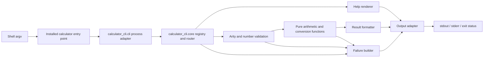
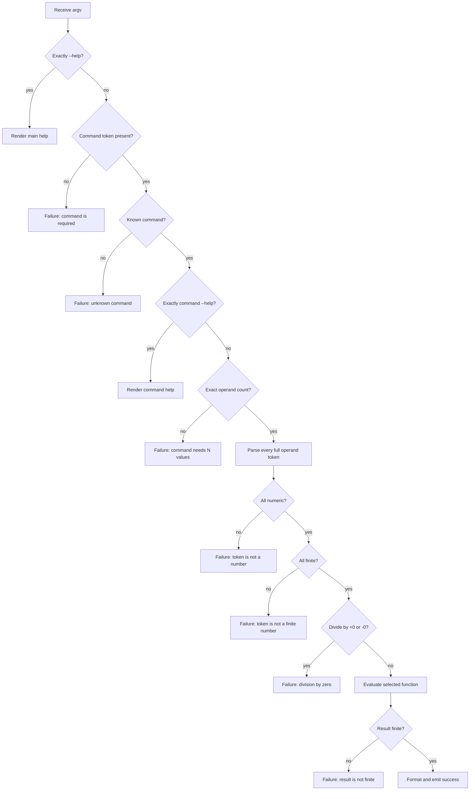

## Context

This is a new, stateless command-line program; there is no existing API or stored data to preserve. The approved behavior is defined by [proposal.md](proposal.md) and [specs/calculator-cli/spec.md](specs/calculator-cli/spec.md). The implementation must keep standard output machine-friendly while providing help and failures on the specified streams.

The supported runtime is CPython 3.11 or newer. The installed program uses only the Python standard library and pure calculation functions; packaging tools are build-time concerns and are not runtime dependencies. Python `float` supplies the chosen IEEE 754 binary64 representation, while `math.isfinite` and `math.pi` provide the finite checks and π value. This format provides the required decimal, infinity, overflow, and π behavior without introducing a decimal or units library.

## Goals / Non-Goals

**Goals:**

- Give every command one shared route from argument parsing through validation, calculation, formatting, and output.
- Make command names, arity, help text, and examples data-driven so routing and help cannot acquire separate command lists.
- Define validation order, output ownership, numeric representation, and failure behavior precisely enough for deterministic implementation and tests.
- Keep calculations pure and independently testable from process arguments and output streams.

**Non-Goals:**

- Interactive input, expressions, command aliases, localization, configuration, networking, or persistence.
- Arbitrary-precision or exact decimal arithmetic.
- A reusable public library API beyond the internal separation needed to test the CLI.

## Decisions

The design uses a CPython package with one installed console entry point, a table-driven execution pipeline, explicit outcome values, binary64 calculations, and centralized formatting. The sections below give each decision, rationale, and rejected alternatives.

## Component Diagram

### Decision: Use a table-driven, single-process architecture

The executable contains a process adapter, a command registry/router, shared validation, pure calculators, and an output adapter. There are no services or external calls.



The command registry is the single source of truth for the eight names. Each entry supplies its operand count and names, short goal, example, and calculator function. The main help iterates this registry, and command help renders the selected entry. Adding a command therefore requires one registry entry plus its pure calculator.

Alternatives considered:

- Separate hand-written subcommand branches would duplicate arity checks, failure handling, and help metadata.
- A third-party CLI framework would supply routing and help, but the checked requirements are small and do not justify a dependency or framework-specific parsing behavior.

### Decision: Package for CPython 3.11+ with a console-script entry point

The implementation uses the following layout:

```text
pyproject.toml
src/calculator_cli/__init__.py
src/calculator_cli/cli.py
src/calculator_cli/core.py
tests/test_core.py
tests/test_cli.py
```

`pyproject.toml` uses this minimal packaging contract:

```toml
[build-system]
requires = ["setuptools>=68"]
build-backend = "setuptools.build_meta"

[project]
name = "calculator-cli"
version = "0.1.0"
requires-python = ">=3.11"
dependencies = []

[project.scripts]
calculator = "calculator_cli.cli:main"

[tool.setuptools.packages.find]
where = ["src"]
```

Setuptools is isolated to build and installation; it is not imported by the installed program. The generated launcher calls `calculator_cli.cli:main`; `main(argv: Sequence[str] | None = None) -> int` reads `sys.argv[1:]` when no argument list is supplied, emits the completed outcome once, and returns the selected status for the launcher to pass to the shell.

`calculator_cli.core` owns command metadata, routing, validation, calculations, help rendering, and result formatting without reading process globals or writing streams. `calculator_cli.cli` owns only the process boundary and output adapter. `__init__.py` has no import-time behavior. Tests use the standard-library `unittest` and `subprocess` modules: unit tests exercise `core` directly, while process tests invoke the installed `calculator` launcher and capture its streams and status.

CPython 3.11 is the minimum so parsing and shortest-representation behavior are tested against one explicit runtime baseline. Supporting older Python versions or alternate Python implementations was rejected because it would widen the parsing, formatting, and packaging compatibility matrix without changing the approved CLI behavior. A standalone script was rejected because it would not provide a standard install mechanism for the required command. A third-party runtime CLI or numeric library was rejected because the standard library supplies every required operation.

## Minimal Data Model

### Decision: Model execution as a value and emit once

The core returns exactly one outcome to the process adapter. It does not write directly to either stream. The minimal in-memory model is:

| Type | Fields | Purpose |
| --- | --- | --- |
| `CommandSpec` frozen dataclass | `name: str`, `operand_names: tuple[str, ...]`, `goal: str`, `example: str`, `calculate: Callable[[tuple[float, ...]], float]` | Registry entry used by routing, help, arity validation, and execution. |
| `Success` frozen dataclass | finite `value: float` | Calculation completed and is ready for formatting. |
| `Help` frozen dataclass | rendered `text: str` | Main or command help completed successfully. |
| `Failure` frozen dataclass | `kind: FailureKind`, short `reason: str` | Expected input or calculation failure. |

Arguments and outcomes exist only for one invocation; nothing is persisted. `len(operand_names)` is the command arity, so arity is not stored twice. `FailureKind` is an enum with `missing-command`, `unknown-command`, `wrong-arity`, `not-a-number`, `non-finite-input`, `division-by-zero`, and `non-finite-result`. The core return type is the closed union `Success | Help | Failure`.

The process adapter emits only after it receives a complete outcome:

- `Success`: format the value, append one line break, write it to standard output, leave standard error empty, and exit `0`.
- `Help`: write the rendered help to standard output, leave standard error empty, and exit `0`.
- Expected `Failure`: leave standard output empty; write the reason and `Run 'calculator --help' for help.` to standard error; exit `2`.
- Unexpected internal exception: catch it only at the process boundary, leave standard output empty, write a short internal-error reason and the same help hint to standard error, and exit `1`.

Buffering the small result/help/error text until the outcome is known prevents a failed operation from leaking a partial result. Printing from each parser or calculator branch was rejected because it makes the empty-standard-output guarantee difficult to enforce.

## Event Flow

### Decision: Route and validate in a fixed order

The event flow for each invocation is:



Help is recognized only in the two exact forms above. Negative operands such as `-2` are positional values, not options. An invocation with extra tokens, including tokens after `--help`, follows the normal unknown-command or wrong-arity path instead of silently ignoring input.

Each numeric parser must consume the full token. The standard-library regular expression `^[+-]?(?:[0-9]+(?:\.[0-9]*)?|\.[0-9]+)(?:[eE][+-]?[0-9]+)?$` first accepts signed decimal whole or fractional forms, with an optional decimal exponent; `float(token)` then converts the accepted token to binary64. The parser also recognizes the exact tokens `NaN`, `Infinity`, `+Infinity`, and `-Infinity` before applying `math.isfinite`, so they produce the required “not a finite number” reason. A finite-form token that converts to infinity follows the same path. All other text, including Python spellings such as `inf`, case variants, underscores, hexadecimal numbers, whitespace, or a numeric prefix followed by junk, is “not a number.” Validation reports the first bad operand from left to right.

Alternatives considered:

- Letting a generic option parser process all tokens risks treating negative numbers as flags.
- Validating numeric tokens before arity produces less useful errors for missing or extra operands.

## Calculation Approach

### Decision: Keep calculations direct and verify every returned value

The registry maps commands to pure binary64 functions:

| Command | Calculation |
| --- | --- |
| `add` | `first + second` |
| `subtract` | `first - second` |
| `multiply` | `first * second` |
| `divide` | `first / second`, after rejecting both signs of zero |
| `celsius-to-fahrenheit` | `(value * (9 / 5)) + 32` |
| `fahrenheit-to-celsius` | `(value - 32) * (5 / 9)` |
| `degrees-to-radians` | `value * (π / 180)` |
| `radians-to-degrees` | `value * (180 / π)` |

The four conversion scale factors `9 / 5`, `5 / 9`, `math.pi / 180`, and `180 / math.pi` are computed once as Python `float` constants. Each converter multiplies by its scale factor, with the required subtraction before the Fahrenheit-to-Celsius scale and addition after the Celsius-to-Fahrenheit scale. This grouping is algebraically equivalent to the specified formulas but avoids overflowing a numerator that a later division would bring back into range. The shared postcondition applies `math.isfinite(result)` after every function, including unit conversions; any genuinely non-finite final value becomes `non-finite-result`. Calculators never format or emit values. Arbitrary-precision intermediates were considered, but combined factors solve the avoidable-overflow problem without adding another number representation or dependency.

Binary64 is preferred over arbitrary-precision decimal because angle conversion already requires an approximate π and the specification explicitly requires detection of non-finite overflow in the chosen format. The trade-off is ordinary floating-point rounding, which tests assess with exact expected text only for exactly representable/simple results and with the specified tolerance for angle results.

## Result Formatting and Help

### Decision: Use one canonical result formatter and generated help

The result formatter starts with Python's `repr(float)`, which emits the shortest round-trippable decimal representation on supported CPython versions. It returns `0` when the value compares equal to zero, so both signs of zero are normalized. Otherwise it removes `.0` only when that exact suffix ends a non-exponent representation. It adds no labels, units, spaces, or explanatory text. Scientific notation is allowed when `repr` selects it as the shortest faithful representation. This policy gives simple outputs such as `5`, `3.75`, and `180` while retaining useful precision for π-based results.

The help renderer reads only `CommandSpec` metadata. Main help starts with a `calculator <command> <values>` usage line and lists all eight commands. Command help includes a command-specific usage line, command name, goal, operand names, and its example. Renderers always end help text with one line break.

A fixed decimal-place count was rejected because it would either lose angle precision or add misleading zeros. Duplicated static help blocks were rejected because they can drift from accepted command names and arities.

## Failure Modes

### Decision: Standardize expected failures

Expected failures use stable short reasons:

| Failure mode | Detection | Reason template |
| --- | --- | --- |
| No command | No argument in the command position | `a command is required` |
| Unknown command | Registry lookup misses | `<token> is not a known command` |
| Missing or extra values | Operand count differs from registry arity | `<command> needs one value` or `<command> needs two values` |
| Malformed number | Full-token numeric parse fails | `<token> is not a number` |
| Non-finite input | Parsed value is NaN or positive/negative infinity | `<token> is not a finite number` |
| Division by zero | Divisor compares equal to zero, including `-0` | `division by zero is not allowed` |
| Non-finite result | Shared result check sees NaN or infinity | `result is not finite` |
| Unexpected internal error | Exception reaches process boundary | `an internal error occurred` |

Every expected failure takes the same output path: no standard output, the reason plus help hint on standard error, and status `2`. Error text does not include a stack trace. Internal errors use status `1` so defects remain distinguishable from user mistakes while still meeting the non-zero requirement.

## Risks / Trade-offs

- [Binary64 rounds some decimal calculations] → Use shortest round-trippable output, preserve full internal precision, and use tolerance-based assertions where exact decimal text is not required.
- [Python numeric parsing accepts spellings outside the chosen grammar] → Gate `float` conversion with the explicit full-token grammar and test exponent input, rejected spellings, signed zero, large magnitudes, and non-finite conversions.
- [Formatting behavior could change in a future runtime] → Require CPython 3.11 or newer, centralize `repr` normalization, and pin exact output cases in process tests across each supported release line.
- [A naive conversion order can overflow before division rescales the value] → Precompute combined binary64 scale factors, then apply the shared finite-result postcondition to the actual returned value.
- [Command metadata can disagree with a calculator signature] → Give calculators one uniform list-of-values interface and derive arity solely from `operandNames`.
- [Direct writes can violate empty standard output on late failure] → Return an `Outcome` and emit once at the process boundary.

## Migration Plan

There is no data or API migration. Build and install the package in a clean CPython 3.11 virtual environment from the repository root, then smoke-check the installed launcher with these exact commands:

```sh
python3.11 -m venv .venv-calculator-smoke
. .venv-calculator-smoke/bin/activate
python -m pip install .
python -m pip check
test "$(command -v calculator)" = "$VIRTUAL_ENV/bin/calculator"
calculator --help
test "$(calculator add 2 3)" = "5"
test "$(calculator celsius-to-fahrenheit 0)" = "32"
```

Process tests must additionally exercise all eight commands, both help paths, and every failure category while asserting standard output, standard error, and exit status. Promotion uses the same built distribution and `[project.scripts]` launcher mechanism in the target environment.

Rollback uninstalls the distribution that owns the launcher and verifies that the environment no longer contains the command:

```sh
python -m pip uninstall -y calculator-cli
hash -r
test ! -e "$VIRTUAL_ENV/bin/calculator"
deactivate
```

No state restoration or data rollback is needed.
