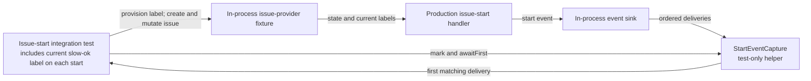

## Context

See `proposal.md` for the motivation and `specs/sandbox-start-labels/spec.md` for the required observations. This change adds integration coverage around the existing issue-start path. It does not change the event contract, production behavior, or stored data.

The test observes two Todo transitions from one issue. The first transition occurs with `slow-ok` attached; the second occurs after the issue has left Todo and the label has been removed. Each observation starts at an exclusive capture boundary so an older delivery cannot silently satisfy a later assertion.

The test boundary is in-process. It uses the repository's issue-provider fixture and event sink, not a live issue provider. It therefore needs no external credentials and creates no durable issue, label, or workspace records. The fixture dataset and captured events are discarded after the test, including on failure.

## Goals / Non-Goals

**Goals:**

- Exercise the production issue-start handler through the in-process integration fixture.
- Prove that each captured start delivery contains the label state for its own Todo transition.
- Make both event waits deterministic, bounded, and diagnostic.
- Keep fixture setup and teardown isolated from other tests.

**Non-Goals:**

- Changing how start events are produced, serialized, delivered, or stored.
- Adding a label-specific field or another production event field.
- Calling a live issue provider or testing provider authentication.
- Testing sandbox selection or labels other than `slow-ok`.

## Decisions

### Use one integration test across two real state transitions

One test creates one uniquely identified issue in the fixture's non-Todo reset state. Fixture setup waits until that initial state is observable before any capture boundary is recorded. This prevents issue creation in Todo, or a Todo-equivalent state, from emitting an unlabelled start before the test is ready.

The test then starts the issue twice. Between starts it moves the issue back to the same non-Todo reset state and waits until the change is observable. Two tests or two issues were considered, but they would not expose label state carried from an earlier start of the same issue.

### Provision `slow-ok` inside the isolated fixture

Fixture setup ensures that a label whose exact name is `slow-ok` exists in the fixture dataset before the issue is created. The setup returns the label identity used by add and remove operations. It must fail as a setup error if the label cannot be provisioned; the test must not reinterpret that failure as a missing start event.

The fixture owns the label and its isolated dataset. Teardown discards both, so the test neither depends on shared seed data nor deletes or mutates a label visible to other tests. Relying on a pre-existing workspace label was considered and rejected because a missing label would make the result environment-dependent.

### Add a suite-local capture boundary helper

The test belongs beside the existing issue-start integration coverage and is identified by the test title `includes current slow-ok label on each start`. The service-provided context does not declare a repository path or an existing boundary API, so the implementation must add the boundary support as a test-only helper in that suite rather than assume an unnamed helper exists.

The helper, called `StartEventCapture` in this design, wraps the suite's in-process event sink. It appends every delivered start event to a per-test list and assigns a monotonic, zero-based capture position. `mark()` returns the next position as an exclusive boundary. `awaitFirst(issueId, boundary, timeout)` examines deliveries in position order and returns the first start event for that issue at or after the boundary. It must not skip an earlier matching delivery in favor of a later retry with a more convenient payload.

Each wait uses a five-second timeout. On expiry, the helper reports the issue identity, phase (`labeled` or `unlabeled`), boundary, and matching positions seen. Five seconds is long enough for in-process asynchronous delivery while keeping a broken transition from stalling the suite. An unbounded poll and a "latest event" query were rejected because both hide ordering errors.

### Assert event labels at the delivery boundary

Assertions read the existing event label-name collection, not the issue after transition. The labeled delivery must contain `slow-ok`; the unlabeled delivery must not. Other labels and label ordering are ignored.

The first and second observations must have different capture positions. If the existing envelope also exposes a stable event ID or producer sequence, the test records it and requires the values to differ. A timestamp, alone or combined only with wall-clock comparison, is not an acceptable identity or distinctness proof because its resolution may be coarser than the two starts. No production field is added solely for this test.

Selecting the first match makes duplicate delivery behavior visible. In particular, if a retry of the labeled event is the first match after the second boundary, the negative label assertion fails immediately instead of silently moving to a later event.

## Component diagram

The components are existing production roles plus one test-only capture helper added by this change.

- **Issue-start integration test:** sequences setup, both starts, assertions, and teardown.
- **In-process issue-provider fixture:** owns the isolated issue and label dataset and acknowledges mutations.
- **Production issue-start handler:** snapshots issue data and emits the existing start event; it is exercised but unchanged.
- **In-process event sink:** receives events without an external provider or durable side effect.
- **`StartEventCapture`:** provides per-test positions, exclusive boundaries, ordered selection, and the five-second wait.

## Event flow

1. Start an isolated in-process fixture dataset and provision the `slow-ok` label.
2. Create one uniquely identified issue in the fixture's non-Todo reset state. Await acknowledgement and assert that the observed state is not Todo or a Todo-equivalent state.
3. Add `slow-ok` by its fixture label identity and await acknowledgement.
4. Call `mark()` to establish the first exclusive boundary, then move the issue to Todo.
5. For at most five seconds, await the first start delivery for the issue at or after that boundary. Record its capture position and any stable event ID or sequence, then assert that its label names contain `slow-ok`.
6. Move the issue back to the non-Todo reset state. Await acknowledgement and assert that it is no longer in Todo.
7. Remove `slow-ok` and await acknowledgement.
8. Call `mark()` to establish the second exclusive boundary, then move the issue to Todo again.
9. For at most five seconds, await the first matching delivery. Require a new capture position and, when available, a different stable event ID or sequence. Assert that its label names do not contain `slow-ok`.
10. Tear down the fixture dataset and capture list through the suite lifecycle, even if setup, a wait, or an assertion fails.

Completing each mutation before recording the following boundary and Todo transition makes the expected snapshot deterministic. The consumer can therefore use the event immediately without a later issue lookup.

## Minimal data model

No production or persisted model is introduced. The test-only state is:

| Value | Representation and use |
| --- | --- |
| Fixture label | Existing fixture label identity plus exact name `slow-ok`; used for acknowledged add/remove operations. |
| Issue | Existing issue identity, current state, and current label collection in the isolated fixture dataset. |
| Captured delivery | Existing start-event envelope and payload plus a test-only monotonic capture position. |
| Capture boundary | Integer returned by `mark()`; only positions at or after it are eligible. |
| Stable event discriminator | Existing event ID or producer sequence when present; timestamp-only values are ignored for identity. |
| Event label names | Existing payload collection used for membership assertions. |
| Wait phase | Test-only `labeled` or `unlabeled` value used only in timeout diagnostics. |

`StartEventCapture` is memory-only and scoped to one test. Its positions do not enter the production event schema or storage.

## Failure modes

- **[The fixture creates the issue in Todo]** → Request the non-Todo reset state during creation, await acknowledgement, and fail setup before the first boundary if the observed state is Todo-equivalent.
- **[`slow-ok` cannot be provisioned]** → Fail fixture setup with a label-specific error; do not continue to the event wait.
- **[A label or state mutation races event creation]** → Await each fixture acknowledgement before recording the boundary and entering Todo.
- **[No matching event arrives]** → Stop after five seconds and report the issue, phase, boundary, and observed matching positions.
- **[Several deliveries match after a boundary]** → Assert the first match in capture order; never choose a later payload based on its labels.
- **[A retry of the first start arrives during the second phase]** → The first-match rule exposes it and the unlabeled assertion fails instead of skipping it.
- **[Another test's event is observed]** → Use a per-test sink and capture list, and still correlate every lookup by the unique issue identity.
- **[The two observations are confused]** → Require different capture positions and different stable IDs or sequences when the envelope provides them; never use timestamp-only equality.
- **[Fixture state leaks after failure]** → Register teardown when the fixture dataset starts so issue, label, and capture state are discarded on every exit path.
- **[The assertion overfits unrelated payload details]** → Compare `slow-ok` membership only, without exact-set or ordering checks.

## Risks / Trade-offs

- **[The in-process fixture cannot reveal live-provider delivery behavior]** → Keep this test focused on the approved issue-start payload requirement; provider authentication and remote delivery remain outside scope.
- **[Five seconds is slower than ordinary in-process delivery]** → Pay the delay only on failure in exchange for deterministic termination and useful diagnostics.
- **[Capture position identifies a delivery, not a producer event]** → Also compare an existing stable event ID or sequence when available, and rely on first-match label assertions to expose stale retries rather than skip them.
- **[Adding a capture helper increases test code]** → Keep it suite-local and limited to ordered append, `mark()`, and bounded `awaitFirst()` behavior.

## Migration Plan

Add the named test case and `StartEventCapture` to the existing in-process issue-start integration suite, then run that suite through the repository's standard test runner. No data migration, deployment order, credentials, or provider cleanup is required because production code and external systems are unchanged. Rollback consists of reverting the test-only additions; a product failure exposed by either label assertion must be fixed rather than weakening the assertions.
