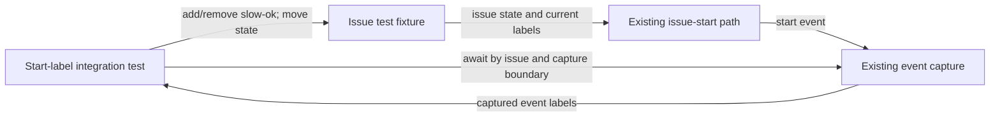

## Context

See `proposal.md` for the motivation and `specs/sandbox-start-labels/spec.md` for the required observations. This change adds integration coverage around the existing issue-start path. It does not change the event contract, production behavior, or stored data.

The test must observe two start events from the same issue. The first event is produced after `slow-ok` is present; the second is produced after that label is removed. The observation boundary for each start must exclude older events so the second assertion cannot accidentally inspect the first event.

## Goals / Non-Goals

**Goals:**

- Exercise the same state transition and event capture path used by issue starts.
- Prove that each captured event contains the label state for its own start.
- Correlate both events to one test issue and prove that they are distinct start occurrences.
- Keep asynchronous waiting and cleanup bounded so failures are clear and isolated.

**Non-Goals:**

- Changing how start events are produced, serialized, delivered, or stored.
- Adding a label-specific field or another event schema.
- Testing sandbox selection after the event is received.
- Covering labels other than `slow-ok`.

## Decisions

### Use one integration test across two starts

The test uses one uniquely identifiable issue for both phases. This preserves the history needed to detect accidental reuse of the first event's label state. Before the first start, it adds `slow-ok`. Before the second start, it moves the same issue from Todo to the fixture’s non-Todo reset state and waits until the state change is acknowledged. It then removes `slow-ok`, waits for that mutation, and moves the issue back to Todo.

Two independent tests or two issues were considered. They would show labeled and unlabeled payloads, but they would not prove that a later start avoids state carried over from an earlier start. Keeping both phases in one test directly covers that risk.

### Observe the emitted start events

Assertions read the labels from the captured start-event payload, not from the issue after its state transition. Each transition records an event-capture boundary first, waits for the next matching start event after that boundary, and correlates it by issue identity. The second event must also have a different event identity or capture position from the first.

Reading the current issue was considered, but that only verifies fixture setup. Reading the latest event without a boundary was also considered, but it could pass by selecting a stale event.

### Reuse existing event labels without introducing a model

The assertion uses the existing event label collection and compares label names. The first event must contain `slow-ok`; the second must not contain it. Other labels are irrelevant and need not be removed or asserted.

A dedicated Boolean such as `slowSandboxAllowed` was considered and rejected because the approved plan requires test coverage only and explicitly excludes API or stored-data changes.

## Component diagram

The names below describe responsibilities rather than new production components.

- **Start-label integration test:** sequences both starts and owns the assertions.
- **Issue test fixture:** creates one isolated issue, mutates its labels, performs the Todo transitions, and cleans up.
- **Existing issue-start path:** snapshots the issue data used to build each start event; it is exercised but not changed here.
- **Existing event capture:** exposes emitted events to the test and supports selecting a new event for the test issue.

### Event flow

1. Create an isolated issue and establish an event-capture boundary.
2. Add `slow-ok`, wait for the label mutation to be acknowledged, and move the issue to Todo.
3. Await the new start event for that issue after the first boundary. Record its identity or capture position and assert that its label names contain `slow-ok`.
4. Move the same issue from Todo to the fixture’s non-Todo reset state. Wait until the reset is acknowledged and the issue is no longer in Todo.
5. Remove `slow-ok` and wait for that mutation to be acknowledged. Establish a second capture boundary, then move the issue back to Todo.
6. Await the new start event for that issue after the second boundary. Assert that it is distinct from the first event and that its label names do not contain `slow-ok`.
7. Clean up the test issue and any fixture state through the existing test lifecycle.

The label mutation is completed before each Todo transition. This ordering makes the expected snapshot deterministic and verifies that the start event can be consumed immediately without a later issue lookup.

### Minimal data model

No new persisted model is introduced. The test needs only these logical values from existing fixtures and event payloads:

| Value | Minimum use in the test |
| --- | --- |
| Issue identity | Correlate captured events to the issue created by this test. |
| Issue state | Trigger each start by moving the issue to Todo. |
| Current issue labels | Set `slow-ok` before the first start and remove it before the second. |
| Event identity or capture position | Prove that the second observation is a new start event. |
| Event label names | Assert membership of `slow-ok` independently for each event. |

The event identity may be an existing event ID, sequence, timestamp plus boundary, or the capture helper's position. The implementation should use the strongest stable discriminator already exposed by the test harness and must not add a production field solely for this test.

## Failure modes

- **[An old event is selected]** → Capture a boundary before each start, filter by issue identity, and require the second observation to be distinct from the first.
- **[The second start is attempted while the issue is still in Todo]** → Move it to the fixture’s non-Todo reset state and await state acknowledgement before removing the label and re-entering Todo.
- **[The label mutation races the Todo transition]** → Await acknowledgement of the add or remove operation before changing state.
- **[Another test's event is observed]** → Create a unique issue and correlate every event lookup to its identity.
- **[No event arrives or more than one event is ambiguous]** → Use the existing bounded event wait and fail with the issue identity and start phase in the assertion message.
- **[The producer reuses stale labels]** → Keep both starts in one test; the second negative assertion is the intentional detector for this failure.
- **[Fixture state leaks after a failure]** → Register cleanup when the issue is created so it runs even if either event assertion fails.
- **[The test overfits payload ordering or unrelated labels]** → Compare label-name membership only; do not require a label order or an exact full label set.

## Migration Plan

Add the test to the existing issue-start integration suite and run that suite through its normal test command. There is no data migration or deployment sequencing because production code and schemas are unchanged. Rollback consists only of reverting the test if the test infrastructure itself proves incompatible; a product failure exposed by the test should be fixed rather than weakening either assertion.
