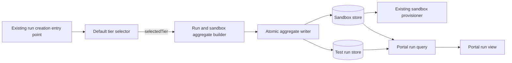

## Context

See `proposal.md` for motivation and `specs/test-run-sandbox/spec.md` for required behavior. The change touches the run-creation decision, the linked run and sandbox records, sandbox provisioning, and the portal read path. The design must keep one selected tier consistent across those boundaries without expanding the run-creation contract or introducing a new delivery subsystem.

No repository-specific component guidance is declared for this change. The component names below therefore describe responsibilities to place in the existing creation, persistence, provisioning, and portal paths; they do not require new services or modules.

## Goals / Non-Goals

**Goals:**

- Evaluate the default-tier rule once for each new run.
- Commit identical tier values on the new run and its linked sandbox.
- Make provisioning and portal display consume the saved sandbox tier.
- Define an atomic linking strategy and deterministic failure behavior.

**Non-Goals:**

- Adding replay keys, request fingerprints, or a new caller requirement.
- Adding an outbox, dispatcher, retry scheduler, or new provisioning-delivery guarantee.
- Changing how runs with a `slow-ok` label select a tier.
- Backfilling or repairing existing records.
- Redesigning sandbox lifecycle states, label storage, or portal navigation.

## Component Diagram



- The **default tier selector** is the only responsibility that interprets `slow-ok`. It returns the canonical `Standard-2` value when that exact label is absent and delegates to the existing labeled-run behavior when it is present.
- The **aggregate builder** holds one `selectedTier` value, allocates both record identities, and copies that value into the run and sandbox records.
- The **atomic aggregate writer** commits both linked records together. It never exposes a newly created run without its sandbox or with unequal tiers.
- The **existing sandbox provisioner** receives the committed sandbox identity and reads `sandbox.tier`; it does not select a default.
- The **portal run query** joins the run to its sandbox and returns the sandbox's saved tier for display.

## Event Flow

1. The existing run-creation entry point receives the new run data and labels through its unchanged interface. Label normalization remains the responsibility of the existing label path.
2. The selector tests membership of the exact normalized label `slow-ok`. If the label is absent, it returns the canonical `SandboxTier.Standard2` value whose external text is `Standard-2`. If the label is present, it invokes the existing selection behavior unchanged.
3. Creation stores the result in one local `selectedTier` value. The aggregate builder pre-generates `run.id` and `sandbox.id`, sets the reciprocal links, sets `run.sandboxTier = selectedTier`, and sets `sandbox.tier = selectedTier`.
4. Before writing, the aggregate writer rejects the aggregate unless the links are reciprocal and the two tier values are equal.
5. In one database transaction, the writer inserts the run first and the sandbox second. The two identifiers already exist, and the reciprocal foreign-key checks are deferred until transaction commit. If the repository's aggregate persistence mechanism does not expose deferrable constraints directly, it must provide the equivalent sequence inside one transaction: insert the run with its sandbox link temporarily unset, insert the sandbox with `runId`, update the run with `sandboxId`, validate equality, and commit. No intermediate state may be visible outside the transaction.
6. After commit, creation invokes the existing provisioning path with `sandbox.id`. Provisioning reads the saved `sandbox.tier` and uses that value for the request. Any existing provisioning retry also reloads the same sandbox record; neither initial provisioning nor retry reevaluates labels.
7. The portal run query loads the run and its linked sandbox. It maps `sandbox.tier` through the shared tier representation and returns `Standard-2` for `SandboxTier.Standard2`. The view renders that returned text and does not infer a tier from labels or a current default.

This change does not add creation replay or dispatch-resumption semantics. Duplicate submissions, provisioning scheduling, and recovery retain their existing behavior; only the tier value passed through those paths changes.

## Minimal Data Model

The design uses only the existing run and sandbox records. Field names are logical names to map onto the repository's current model.

| Record | Field | Meaning or constraint |
| --- | --- | --- |
| Test run | `id` | Stable run identity, allocated before aggregate persistence. |
| Test run | `labels` | Normalized labels used once by the selector. |
| Test run | `sandboxId` | Link to the sandbox created in the same transaction. |
| Test run | `sandboxTier` | Snapshot of the selected tier required on the saved run. |
| Sandbox | `id` | Stable sandbox identity, allocated before aggregate persistence. |
| Sandbox | `runId` | Reciprocal link to the owning run. |
| Sandbox | `tier` | Saved tier used by provisioning and authoritative for portal display. |

`SandboxTier` is one shared canonical type or enumeration used for both saved tier fields and the portal mapping. `Standard-2` is one value in that type rather than separate free-form strings. A newly committed aggregate must satisfy:

```text
testRun.sandboxId == sandbox.id
sandbox.runId == testRun.id
testRun.sandboxTier == sandbox.tier
```

The run copy satisfies the saved-run requirement and supports consistency checks. The sandbox value is authoritative for provisioning and display. Labels are inputs to the one creation-time decision, not a later source of truth.

## Decisions

### Select once at the run-creation boundary

The creation path evaluates `slow-ok` once and passes one typed `selectedTier` value into aggregate construction. This prevents persistence, provisioning, and presentation from applying separate defaults.

**Alternative considered:** Let each downstream component apply the default. This is rejected because independently maintained defaults can drift and produce different values for one run.

### Persist the run and sandbox as one linked aggregate

Both identities are allocated before persistence, and both records are committed in one transaction after reciprocal-link and tier-equality checks. Deferring reciprocal foreign-key validation until commit permits the run-first insert order. Where deferrable constraints are unavailable, the writer uses the transactional insert-and-link sequence described in the event flow.

**Alternative considered:** Insert and commit the run before creating the sandbox. This is rejected because readers could observe an incomplete run and a later failure could leave the required saved values inconsistent.

### Reuse the existing creation and provisioning contracts

The change adds no idempotency input and no delivery data model. After the aggregate commits, the existing provisioning path is invoked with the sandbox identity and reads the tier from the sandbox record. Existing retry and recovery policies remain unchanged.

**Alternative considered:** Add caller-supplied replay keys, fingerprints, and a provisioning outbox. This is rejected because those changes alter the creation interface and operational architecture beyond the approved proposal's impact.

### Render the linked sandbox tier in the portal

The portal query treats `sandbox.tier` as the display source and maps the shared typed value to `Standard-2`. It may compare the run snapshot for diagnostics, but it must not replace the sandbox value with the run value or a label-derived default.

**Alternative considered:** Display `testRun.sandboxTier`. This is rejected because the approved requirement explicitly bases display on the saved sandbox tier.

## Failure Modes

| Failure | Required behavior |
| --- | --- |
| The selector cannot produce a supported canonical tier | Reject creation before either record is written. |
| Aggregate links are not reciprocal or tier values differ before persistence | Reject the aggregate and write neither record. |
| A run insert, sandbox insert, link update, or commit fails | Roll back the transaction so no partial new aggregate is visible; return the existing creation error. |
| Reciprocal foreign-key validation fails at commit | Roll back both records and report persistence failure. |
| Provisioning fails after the aggregate commits | Preserve both saved tier values and use the existing sandbox failure/retry behavior. A retry reloads `sandbox.tier`; it does not reevaluate labels. |
| The process stops after commit but before provisioning is invoked | Recovery follows the existing sandbox lifecycle behavior; this change adds no separate dispatch guarantee or retry loop. The committed tiers remain equal. |
| Portal query finds no linked sandbox | Show the existing unavailable/error state and emit diagnostics; do not synthesize `Standard-2` from labels. |
| Portal query finds different run and sandbox tiers | Emit inconsistency diagnostics and display the sandbox tier, which remains the specified display source. New creation must not produce this state. |
| Portal cannot map the saved tier | Show the existing unknown/unavailable state and emit diagnostics rather than displaying another tier. |

Creation diagnostics should include the run identity, sandbox identity, normalized presence or absence of `slow-ok`, selected tier, invariant-check result, and persistence outcome. Provisioning and portal diagnostics should include both linked identities and the saved sandbox tier. No new retry counters or replay identifiers are introduced.

## Risks / Trade-offs

- **[The current persistence layer may not support deferrable reciprocal foreign keys]** → Use the specified insert-sandbox-update sequence inside one transaction and keep the incomplete link invisible until commit.
- **[Existing provisioning recovery may leave a committed sandbox waiting after a process interruption]** → Retain the current lifecycle and operational behavior; improving delivery guarantees requires a separately approved change.
- **[Historical records may already contain missing links or unequal tiers]** → Keep deterministic sandbox-backed display and diagnostics; leave backfill and repair outside this change.
- **[Rolling back the selector while `Standard-2` records exist could break readers]** → Retain `Standard-2` in the shared tier type and portal/provisioning readers while rolling back only the new default-selection branch.

## Migration Plan

1. Add or confirm `Standard-2` in the shared tier representation used by run persistence, sandbox persistence, provisioning, and portal mapping.
2. Deploy the aggregate-builder and atomic-writer changes while leaving the current tier-selection behavior enabled.
3. Deploy the provisioning and portal reads of `sandbox.tier`.
4. Enable the selector branch that returns `Standard-2` when `slow-ok` is absent.
5. Create a live run without `slow-ok` and verify that the saved run and sandbox tiers are both `Standard-2`, provisioning uses the saved sandbox tier, and the portal shows `Standard-2`.

No data backfill, caller migration, replay-field migration, or outbox migration is required. To roll back, disable the new default-selection branch while retaining read and display support for already saved `Standard-2` values.
