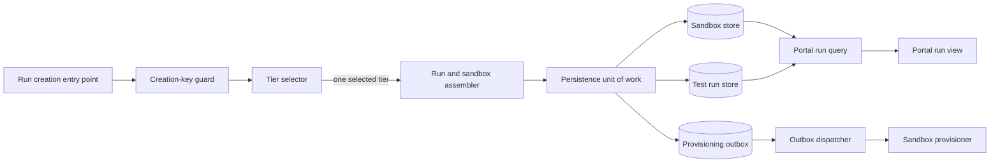

## Context

See `proposal.md` for motivation and `specs/test-run-sandbox/spec.md` for the required behavior. The change crosses run creation, sandbox provisioning, persistence, and the portal. The main design constraint is that the default tier must be chosen once and then remain identical on the linked run and sandbox records while the portal presents the saved sandbox tier. Creation and provisioning may be retried or interrupted, so the chosen tier and the intent to provision must survive process failure.

No repository-specific component guidance is declared for this change, so the component names below describe responsibilities rather than requiring new services or modules. Implementation should place each responsibility in the existing code path that already owns it.

## Goals / Non-Goals

**Goals:**

- Make tier selection deterministic for a new run whose labels do not contain `slow-ok`.
- Carry one selected tier through run persistence, sandbox persistence, and provisioning.
- Ensure a successfully created run cannot expose different saved tiers for the run and its linked sandbox.
- Make creation replay-safe and guarantee that committed provisioning intent is eventually dispatched.
- Make the portal render the tier from the linked sandbox record.
- Define retry and failure behavior without changing the selected tier.

**Non-Goals:**

- Changing tier selection for runs that contain the `slow-ok` label.
- Backfilling or repairing existing run and sandbox records.
- Redesigning the sandbox lifecycle, label system, or portal navigation.
- Adding a second source of tier defaults in the portal or provisioning layer.

## Component Diagram



- The **creation-key guard** derives the owner scope from authenticated server context, authorizes creation and replay access in that scope, and recognizes retries using one scoped key plus a canonical fingerprint of all creation-defining inputs.
- The **tier selector** is the only component that applies the default rule. It returns `Standard-2` when `slow-ok` is absent and delegates to the existing labeled-run behavior when it is present.
- The **run and sandbox assembler** copies the same selected value into both records and the provisioning command. It does not call the selector twice.
- The **persistence unit of work** writes the linked run, sandbox, and provisioning outbox record atomically.
- The **outbox dispatcher** durably retries delivery. The **sandbox provisioner** treats the sandbox identity as the idempotency key.
- The **portal run query** reads the linked sandbox tier and exposes it to the view. The view does not infer a default from labels.

## Event Flow

1. The run creation entry point resolves `ownerScopeId` from the authenticated principal and existing run-authorization boundary; caller input cannot override it. It then receives a stable `creationKey`, the new run data, and its labels. It computes `requestFingerprint` as SHA-256 over canonical UTF-8 JSON containing every creation-defining input. Object keys and set-like labels are sorted, label values are normalized exactly as tier selection consumes them, and transport-only values such as delivery time are excluded. The caller must reuse the same key and inputs when retrying the same creation request.
2. Within the creation transaction, the creation-key guard authorizes the request and looks up `(ownerScopeId, creationKey)` only inside that owner scope. If it already identifies a run with the same `requestFingerprint`, creation returns or resumes that run and does not create another pair. If the key is reused with a different fingerprint, creation returns a conflict.
3. For a new key, the tier selector checks membership of the exact `slow-ok` label. When it is absent, the selector returns the canonical tier value `Standard-2`. When it is present, control remains with the existing selection path.
4. Creation keeps the result in one `selectedTier` value. It creates the run and linked sandbox records with `run.sandboxTier = selectedTier` and `sandbox.tier = selectedTier`.
5. Creation also builds one pending provisioning outbox record containing the linked sandbox identity and `selectedTier`. Before persistence, it verifies that all three tier values match and that the run and sandbox links are reciprocal.
6. The persistence unit of work commits the run, sandbox, and pending outbox record together. A partial unique constraint on `(ownerScopeId, creationKey)` makes concurrent delivery deterministic. The run insert occurs before sandbox or outbox inserts. On conflict, the losing transaction is rolled back completely. A new read transaction at read-committed isolation or stronger then loads the scoped winner after it commits and compares its fingerprint. If no winner becomes visible because the competing transaction rolled back, creation retries from the beginning.
7. The outbox dispatcher sends the provisioning command after commit, keyed by `sandbox.id`. A committed but undispatched command remains pending and is picked up after a worker restart or by periodic outbox scanning.
8. The provisioner treats repeated commands for the same `sandbox.id` and tier as the same operation. After provisioning succeeds, the existing sandbox lifecycle records success and the outbox record is acknowledged. If success occurs but acknowledgement is interrupted, redelivery is safe because the command is idempotent.
9. Every provisioning retry uses the tier stored in the outbox and verifies it against `sandbox.tier`. It must not reevaluate labels or apply a current default.
10. When a person views the run, the portal query loads its linked sandbox and returns the sandbox's saved tier. The view renders the canonical display text `Standard-2` for that value.

## Minimal Data Model

The design uses the existing run and sandbox records plus a durable provisioning outbox record:

| Record | Required field | Meaning or constraint |
| --- | --- | --- |
| Test run | `id` | Stable run identity. |
| Test run | `ownerScopeId` | Authenticated project or tenant ownership boundary used by existing run authorization. |
| Test run | `creationKey` | Stable request identity; required for new runs, nullable for legacy rows, and unique with `ownerScopeId` when non-null. |
| Test run | `requestFingerprint` | SHA-256 of the owner scope and all canonical creation-defining inputs; required with a new creation key and nullable for legacy rows. |
| Test run | `labels` | Normalized creation labels used for tier selection and included in the request fingerprint. |
| Test run | `sandboxId` | Link to the sandbox created for the run. |
| Test run | `sandboxTier` | Snapshot of the one tier selected at creation. |
| Sandbox | `id` | Stable sandbox identity and provisioning idempotency key. |
| Sandbox | `runId` | Link back to the owning run. |
| Sandbox | `tier` | Authoritative saved tier for provisioning and portal display. |
| Provisioning outbox | `eventId` | Unique dispatch record identity. |
| Provisioning outbox | `sandboxId` | Target sandbox; unique for the create operation. |
| Provisioning outbox | `tier` | Immutable copy of the selected tier. |
| Provisioning outbox | `deliveryState` | Pending or acknowledged dispatch state. |

Legacy runs may have null `creationKey` and `requestFingerprint` and no provisioning outbox record. New-run validation requires both replay fields, and a partial unique constraint on `(ownerScopeId, creationKey)` applies only where `creationKey` is non-null. Legacy rows remain readable but cannot be matched as retries of a newly keyed request.

`SandboxTier` is one canonical type or enumeration used for all three tier fields. `Standard-2` must be one value in that type; it must not be represented by separate free-form strings in each component. For a newly committed creation, the invariant is:

```text
testRun.sandboxId == sandbox.id
sandbox.runId == testRun.id
testRun.sandboxTier == sandbox.tier
sandbox.tier == provisioningOutbox.tier
provisioningOutbox.sandboxId == sandbox.id
```

The sandbox record is authoritative for provisioning retries and portal display. The run copy exists to satisfy the saved-run requirement and to make consistency verifiable. The outbox copy makes dispatch durable; neither copy is an independent input to tier selection.

## Decisions

### Select once at the run-creation boundary

The creation path evaluates `slow-ok` once and passes the selected tier forward as data. This keeps all downstream writes and side effects tied to one decision.

**Alternative considered:** Let run persistence and sandbox provisioning each apply their own default. This is rejected because defaults can drift and produce different tiers for the same run.

### Identify creation with an authorized, owner-scoped key

Every creation command carries a `creationKey` and a deterministic `requestFingerprint` covering its authenticated owner scope and every creation-defining input. The server derives `ownerScopeId` from authenticated context, performs the normal run authorization check, and queries only that scope. The run store enforces partial composite uniqueness for non-null `(ownerScopeId, creationKey)` values. A replay in the authorized scope with the same fingerprint returns the existing pair; reuse there with a different fingerprint is rejected. The same key in another owner scope is independent and cannot return or block this scope.

**Alternative considered:** Make `creationKey` globally unique. This is rejected because collisions could disclose or block another owner's run. Deduplicating only after finding a matching run or sandbox is also rejected because concurrent commands could both find nothing and create duplicate pairs.

### Persist records and provisioning intent in one unit of work

The run, sandbox, and outbox records are assembled and committed together after an equality check. This makes the cross-record invariant and the intent to provision part of successful creation. The run insert is attempted first; a composite-key conflict aborts and rolls back the whole transaction. Replay handling then uses a fresh read transaction, so it never queries through a transaction invalidated by a constraint conflict.

**Alternative considered:** Save the run and sandbox, then call the provisioner directly. This is rejected because a process crash after commit but before the call can permanently lose provisioning intent.

### Dispatch an idempotent provisioning command from a durable outbox

The dispatcher repeatedly delivers each pending command until it is acknowledged. The stable sandbox identity deduplicates provisioning, including when success is followed by a lost acknowledgement. Retries consume the immutable saved tier rather than selecting again.

**Alternative considered:** Rely on in-memory retry around the first call. This is rejected because restart loses the retry and leaves a committed sandbox unprovisioned.

### Render the linked sandbox tier in the portal

The portal displays the saved value returned for the linked sandbox. It does not infer the value from labels and does not prefer the run snapshot when records disagree.

**Alternative considered:** Display `testRun.sandboxTier`. This is rejected because the specification defines display behavior from the saved sandbox tier and provisioning also follows that record.

## Failure Modes

| Failure | Required behavior |
| --- | --- |
| Tier selection cannot return a supported canonical value | Reject creation before records are written or provisioning intent is committed. |
| Run, sandbox, and outbox tiers differ before commit | Fail the invariant check and roll back the unit of work. |
| Any persistence write fails | Roll back the run, sandbox, and outbox writes; do not report the run as created. |
| Two commands concurrently use one new `creationKey` | The composite constraint permits one pair per owner scope. The loser rolls back, opens a fresh visibility-aware read transaction, and returns the winner only after scoped authorization and fingerprint verification; if no winner committed, it retries creation. |
| An existing `creationKey` is sent with a different request fingerprint | Reject it as a conflicting request; do not alter or duplicate the existing pair. |
| A caller guesses a key used in another owner scope | The lookup remains constrained to the authenticated owner scope, so the other run is neither returned nor treated as a conflict. |
| The process stops after commit but before dispatch | Leave the outbox record pending; a restarted dispatcher or periodic scan sends it. |
| Provisioning fails | Leave or return the outbox record to pending, keep all saved tier values unchanged, and retry with the same sandbox identity and tier. |
| Provisioning succeeds but acknowledgement fails | Redeliver; the provisioner recognizes `sandbox.id` and the same tier as the existing operation, then acknowledgement is retried. |
| A provisioning command's tier differs from the sandbox record | Do not provision, retain the pending record, and emit inconsistency diagnostics for repair. |
| Portal query finds no linked sandbox | Show the existing unavailable/error state and record diagnostics; do not synthesize `Standard-2` from labels. |
| Portal query detects different saved run and sandbox tiers | Treat the pair as inconsistent and record diagnostics. Displaying the sandbox tier remains deterministic, but creation must not produce this state. |
| Portal cannot map the canonical tier to display text | Show the existing unknown/unavailable state and record diagnostics rather than silently presenting another tier. |

Logs or metrics for creation and provisioning should include the authenticated owner scope, creation key, request fingerprint, run identity, sandbox identity, outbox event identity, selected tier, and outcome so a replay, stalled dispatch, mismatch, or failed retry can be traced without making labels a second source of truth.

## Risks / Trade-offs

- **[Atomic persistence may require adapting the existing write boundary]** → Keep all three writes in the smallest existing transaction or unit-of-work boundary and enforce the equality invariant immediately before commit.
- **[An outbox adds delivery state and operational monitoring]** → Scan pending records after startup and on a schedule, retry with bounded backoff, and alert on records that remain pending beyond the normal provisioning window.
- **[At-least-once dispatch can duplicate provisioning calls]** → Key every create operation by `sandbox.id` and require same-key, same-tier calls to return the existing operation.
- **[Creation keys can be accidentally reused]** → Scope lookup and uniqueness to the authenticated owner, then compare the canonical fingerprint and reject conflicting reuse inside that scope.
- **[Existing inconsistent records can still be encountered by the portal]** → Read the sandbox tier deterministically, emit diagnostics, and leave historical repair outside this change.
- **[Rolling back writers while `Standard-2` records exist could break old readers]** → Keep `Standard-2` read, display, outbox, and retry support during rollback; roll back only the new default-selection behavior.

## Migration Plan

1. Ensure persistence, provisioning, and portal read paths accept the canonical `Standard-2` tier value.
2. Add nullable `creationKey` and `requestFingerprint` fields for compatibility, add a partial unique constraint on `(ownerScopeId, creationKey)` where `creationKey` is non-null, and add the provisioning outbox, idempotent sandbox provisioning by sandbox identity, and pending-record monitoring. Keep the old writer valid during this step.
3. Deploy the shared selector and the atomic run, sandbox, and outbox persistence path.
4. Enable the creation path so runs without `slow-ok` select `Standard-2`.
5. Verify a live new run has matching saved run, sandbox, and outbox tiers; provisioning requested `Standard-2`; the outbox was acknowledged; and the portal displays `Standard-2`.
6. Exercise a creation replay and an interrupted-dispatch recovery to verify they reuse one run/sandbox pair and the saved tier.

No data backfill is required: legacy run replay fields remain null, legacy rows need no outbox record, and only the new writer requires a key and fingerprint. To roll back, disable the new default selector while retaining support for reading, displaying, dispatching, and retrying already saved `Standard-2` sandboxes.
