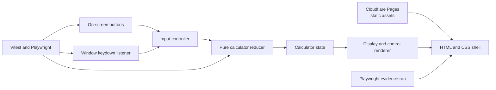

## Context

The repository currently contains planning artifacts but no web application or established application stack. The approved behavior is defined by `proposal.md` and `specs/web-calculator/spec.md`; this document chooses a small browser-only architecture that can meet it without an API or stored data.

The calculator must preserve the text being entered (including an unfinished decimal such as `0.`), perform binary arithmetic, accept equivalent button and keyboard actions, recover from division by zero only through clear, and remain testable at 320 CSS pixels. The implementation also has to produce a deployable preview and reproducible visual evidence.

## Goals / Non-Goals

**Goals:**

- Keep arithmetic rules independent from DOM event handling so every state transition can be unit tested.
- Route button and keyboard input through one action model so the two input methods cannot drift.
- Define result formatting, error recovery, responsive layout, deployment, and evidence capture precisely enough to implement without another design choice.
- Keep runtime delivery to static assets with no server-side state.

**Non-Goals:**

- Expression parsing, precedence, parentheses, unary sign entry, memory keys, history, localization, or persistence.
- Repeated-equals behavior or implicit execution when an operator is selected; equals explicitly completes a pending binary operation.
- An API, authentication, analytics, or a server-side component.
- Treating the review-only key overlay as a production calculator feature.

## Decisions

### 1. Use a framework-free static browser application

The implementation will consist of a semantic HTML shell, CSS, and JavaScript ES modules. Vite will provide the local development server and production asset build, Vitest will exercise the pure calculator module, and Playwright will cover real button, keyboard, and viewport behavior. Application code will use `big.js` for decimal arithmetic but will not depend on a UI framework.

The production build will be static and deploy to Cloudflare Pages. Pages supports static HTML and pull-request preview deployments, which directly supplies the required working review URL: https://developers.cloudflare.com/pages/framework-guides/deploy-anything/.

Alternative considered: a component framework. It would add build and runtime concepts without improving this single-view state machine. Alternative considered: server-rendered calculation. It would add latency and failure surfaces even though all inputs and state are local.

### 2. Normalize every interaction into the same action stream

Every on-screen control will be a native `<button type="button">` with a `data-action` value. Native controls retain browser activation behavior across pointer, keyboard, and assistive input: https://html.spec.whatwg.org/multipage/interaction.html#activation-behavior-of-elements. The display will be an `<output aria-live="polite">` whose visible text is derived from calculator state.

The controller maps both click events and recognized `keydown` values to one of these actions:

| Action | Button values | Keyboard values |
| --- | --- | --- |
| `append_digit` | `0` through `9` | `0` through `9` |
| `append_decimal` | `.` | `.` |
| `select_operator` | `+`, `-`, `×`, `÷` | `+`, `-`, `*`, `/` |
| `calculate` | `=` | `Enter`, `=` |
| `clear` | `C` | `Escape` |

For a recognized calculator key, the controller calls `preventDefault()` and dispatches exactly once. It rejects `Control`, `Meta`, or `Alt` combinations and composition events, but does not reject `Shift`: `KeyboardEvent.key` already contains the character produced by the key press, so shifted `+` and `*` remain valid calculator input (https://www.w3.org/TR/uievents/#interface-keyboardevent). This also prevents an `Enter` key from both calculating and activating whichever calculator button currently has focus. Unrelated keys are ignored, and click handling remains the only path for pointer activation.

After dispatch, the renderer updates the output and the mapped button receives a short-lived pressed class. Pointer presses also use `:active`. This visible feedback is part of normal UI behavior and makes each action observable in the review recording.

Alternative considered: separate click and keyboard calculation handlers. That duplicates transition rules and can produce different results for the same logical action.

### 3. Model the calculator as a deterministic reducer

Reducer behavior is deterministic:

1. A digit replaces the initial `0`, otherwise appends. A decimal appends only when `entry` has no decimal point; from initial `0` it produces `0.`.
2. A digit or decimal in `awaiting_rhs` starts a fresh right-hand entry. The same input in `result` starts a new calculation and clears the stored operation.
3. An operator while entering validates and copies the entry string to `leftOperand`, stores the operator, and enters `awaiting_rhs`. Selecting another operator before a right operand replaces the pending operator without calculating.
4. Calculate is a no-op unless an operator exists and a right operand has been entered. Otherwise it evaluates exactly one binary operation, formats the result into `entry`, clears the pending operation, and enters `result`.
5. An operator selected after a result uses that result as the next left operand. Repeated calculate with no pending operation is a no-op.
6. Clear returns the exact initial state from every phase, including error.

Alternative considered: deriving behavior from loosely related flags such as `shouldResetDisplay`. An explicit phase makes invalid state combinations and recovery rules visible to tests.

### 4. Use decimal arithmetic and limit rounding to non-terminating division

Typed values and stored operands remain strings. At calculation time, strict `big.js` instances are created from those strings. Addition, subtraction, and multiplication return exact decimal results; division is the only supported operation that can require rounding. Configure a private `Big` constructor with 20 decimal places and round-half-up, reject a right operand equal to zero before dividing, then render the result with `toString()`. The library documents exact non-division arithmetic and its division-specific decimal-place and rounding controls: https://github.com/MikeMcl/big.js/.

This policy preserves all entered significant digits for `+`, `-`, and `*`, so `1234567890123 + 1` displays `1234567890124`. It also makes `0.1 + 0.2` exactly `0.3`. A terminating quotient is shown without unnecessary trailing zeros; a repeating quotient is rounded to at most 20 decimal places. Negative zero is normalized to `0`.

If construction or arithmetic throws for malformed programmatic input or an internal library failure, the reducer enters the defensive `result_unavailable` error and renders `Result unavailable`. Clear resets it. This fallback does not replace the required division-by-zero message.

Alternative considered: JavaScript `Number` plus unconditional `toPrecision(12)`. It would round otherwise exact large results because `toPrecision` emits the requested count of significant digits (https://tc39.es/ecma262/#sec-number.prototype.toprecision). Alternative considered: custom scaled integers. They need arbitrary-scale alignment and a separate long-division implementation, recreating the focused behavior already provided by `big.js`.

### 5. Constrain layout with CSS Grid and intrinsic sizing

The page uses a centered calculator panel with `box-sizing: border-box`, a width of `min(100%, 24rem)`, and page padding that is included in the available width. Controls use a four-column CSS Grid with an 8px minimum gap. Every button has a minimum block size of 44px, a minimum inline size of 44px, and font size of at least 16px. The output has a minimum 16px font size and allows long text to wrap within the panel rather than increasing page width.

The 320 CSS-pixel browser test will assert no document-level horizontal overflow and will inspect every control's bounding box, minimum dimensions, gap, clipping, and overlap. This follows WCAG 2.2 Reflow's requirement to preserve information and functionality at a width equivalent to 320 CSS pixels: https://www.w3.org/TR/WCAG22/#reflow. A desktop test will assert the panel is centered and remains within its maximum width.

Alternative considered: fixed pixel widths for the panel and buttons. They make the 320px case dependent on exact browser and page padding and are more likely to create horizontal overflow.

### 6. Make tests and review proof exercise the same public behavior

Vitest table-driven tests will cover all four operations, decimal entry, duplicate-decimal rejection, exact `0.1 + 0.2`, the large exact boundary `1234567890123 + 1`, repeating-division rounding, negative results, clear from partial/result/error states, operator replacement, ignored actions in error, and recovery after division by zero.

Playwright will interact through actual buttons and keyboard events. Its scenarios will cover decimal entry by each input method, all operations across the suite, `Enter`, `=`, `Escape`, visible results and error text, and a fresh calculation after clear. Responsive checks will run at 320px and a desktop width.

A dedicated Playwright evidence scenario will record deliberate pauses between actions so pressed-button feedback remains visible. It will:

1. complete `1.5 + 2.25 =` with buttons;
2. complete `2.5 * 4 Enter` with keys while a proof-only overlay injected by the Playwright page fixture lists each `KeyboardEvent.key`;
3. show clear returning the display to `0`;
4. show `8 / 0 =`, the exact error, clear, and successful `8 / 2 =` recovery.

The overlay is injected only in the evidence browser context and is not included in production assets. The final review links the successful Pages preview, the recording or image sequence, and automated-check output.

Alternative considered: hand-recorded evidence. An automated scenario is repeatable and keeps the proof aligned with the behaviors asserted by the browser suite.

## Component Diagram

The static host serves the shell and modules, while both input adapters converge on the same pure state transition boundary. Rendering is one-way from returned state; tests and the proof runner exercise the same boundaries as people using the page.



The implementation boundaries are:

- `src/calculator.js`: action types, state initialization, reducer, arithmetic, and result formatting; it has no DOM access.
- `src/main.js`: button and keyboard adapters, reducer dispatch, rendering, focus behavior, and temporary pressed-state styling.
- `src/styles.css` and `index.html`: responsive presentation and semantic controls.
- unit tests: state transitions and arithmetic edge cases.
- browser tests and an evidence scenario: user-visible behavior, dimensions, input parity, and proof capture.

## Minimal Data Model

The complete in-memory state is:

```text
entry: string
leftOperand: decimal string | null
operator: "+" | "-" | "*" | "/" | null
phase: "entering" | "awaiting_rhs" | "result" | "error"
error: "divide_by_zero" | "result_unavailable" | null
```

Initial and cleared state is `{ entry: "0", leftOperand: null, operator: null, phase: "entering", error: null }`. No field is persisted. The visible display is derived from `error` (`Cannot divide by zero` or `Result unavailable`) when the phase is `error`, and from `entry` in every other phase.

State invariants:

- `awaiting_rhs` always has a non-null `leftOperand` and `operator`.
- `error` phase has a non-null `error` code and clears `leftOperand` and `operator`; all actions except clear are ignored. Every other phase has `error: null`.
- `entry` is always renderable text. User entry contains digits and at most one decimal point; a result may additionally contain a leading minus sign or exponent notation.
- `leftOperand` is copied only after validating a completed `entry`; the displayed entry string is never reconstructed while the person is still typing.

## Event Flow

For either input method, one user intent follows this sequence:

```text
click or keydown
  -> input adapter recognizes and normalizes one action
  -> reducer receives previous state plus action
  -> reducer returns a new valid state (or the unchanged state for ignored input)
  -> renderer updates output text and pressed feedback
  -> browser exposes the result to the person and to Playwright assertions
```

For `8 / 0 =`, the operator action stores `8`, the digit action starts the right entry as `0`, and calculate detects the zero right operand before division. The reducer enters `error`, clears the pending operation, and the renderer shows `Cannot divide by zero`. Further digits, decimals, operators, and calculate are ignored. Clear or `Escape` creates the initial state, after which `8 / 2 =` follows the normal flow and renders `4`.

## Failure Modes

- **Duplicate decimal input** → Return unchanged state; do not show an error or mutate the current entry.
- **Calculate without both operands** → Return unchanged state so no stale or invented operand is used.
- **Division by zero, including `0.0`** → Enter the locked error phase with exactly `Cannot divide by zero`; only clear recovers.
- **Invalid decimal operation or unexpected arithmetic failure** → Show `Result unavailable`, clear pending arithmetic, and require clear before continuing.
- **Keyboard default or focused-button double dispatch** → Prevent the default action for each recognized calculator key and dispatch once through the keyboard adapter.
- **Control, Meta, Alt, unknown, or composing keyboard input** → Ignore it without state or display changes; allow Shift when it produces a recognized `event.key` such as `+` or `*`.
- **Long display content at narrow width** → Wrap within the output and panel; never grow the document's inline size.
- **Static asset or build failure** → Fail the build/check pipeline and do not present that deployment as the review preview.
- **Preview deployment failure** → Keep the last successful deployment intact, fix the build or configuration, and publish a new immutable preview before review.
- **Evidence capture failure** → Fail the evidence job if an expected result, overlay event, or recording artifact is missing; do not substitute an unverified manual claim.

## Migration Plan

1. Add the static source, test tooling, and deterministic build in the implementation change.
2. Run unit, browser, and production-build checks locally or in CI, including the 320px geometry assertions.
3. Deploy the built static assets to a branch preview and smoke-test the resulting HTTPS URL.
4. Run the evidence scenario against that same preview and attach its artifacts and check results to final review.
5. Promote only the reviewed implementation through the normal merge path.

There is no data migration. Rollback is deployment-level: retain or restore the previous successful static deployment if the new preview or production build fails. Because calculator state exists only in memory, rollback cannot lose user data.
