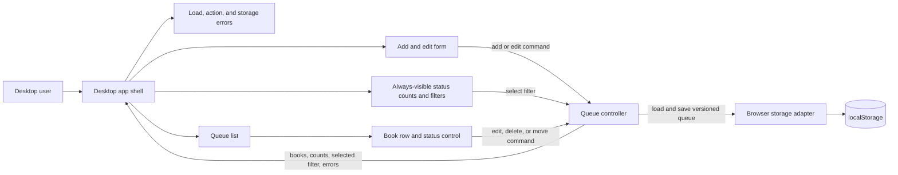

## Context

See `proposal.md` for motivation and `specs/reading-queue-web-app/spec.md` for the required behavior. This is a new, one-screen desktop app with no existing server or API to integrate. All durable data belongs to one browser, and the review artifact must be a finished static build that can be published through the supported static preview path.

The design therefore needs a small client-side boundary that keeps rendering, queue rules, and browser persistence separate enough to test. There is no account, remote synchronization, mobile layout, or production deployment to design.

## Goals / Non-Goals

**Goals:**

- Keep one authoritative in-memory queue and derive the visible list and all three counts from it.
- Validate every add and edit before changing either memory or browser storage.
- Persist each successful queue mutation as one versioned value so a refresh reconstructs the same queue.
- Produce a deterministic static build that can be exercised in a real browser and published with `static-preview-v1`.

**Non-Goals:**

- Server storage, synchronization between tabs or devices, accounts, and access control.
- Import, export, search, sorting controls, pagination, or a phone-specific layout.
- A CI workflow, repository-hosting setup, production release, or backend demonstration.

## Decisions

### Use a single client-side state owner

The page will be a static client application. One queue controller owns the saved `books` collection and accepts explicit commands for add, edit, delete, and status change. The selected filter and edit drafts are transient UI state. UI components receive derived values and send user intent back to the controller; they do not write browser storage directly.

This boundary keeps the storage mechanism replaceable in tests and ensures counts and filters cannot drift from separately maintained copies. A collection of independently stateful rows was rejected because concurrent row state would make edits, status moves, counts, and persistence easier to desynchronize. A server was rejected because it conflicts with browser-local scope and the supported static preview.

### Treat every saved change as one validated transaction

For add, edit, delete, or status change, the controller will construct a candidate collection without mutating current state. It will validate the command, serialize the full storage envelope, and ask the storage adapter to write it. Only after the synchronous write succeeds will the controller replace its in-memory collection and re-render derived values. If validation or persistence fails, the prior collection remains authoritative.

This ordering means a successful on-screen mutation is the same state that a refresh will load. Updating memory first and saving later was rejected because storage failure could leave the displayed queue ahead of the durable queue. Per-book storage keys were rejected because multi-key writes would complicate deletion, loading, and consistency without benefit at this scale.

Title and author inputs are trimmed before validation and storage. An empty trimmed value produces a field-specific inline error. If both are empty, both errors are shown. A successful add assigns `to-read` status. Edit replaces only title and author on the currently saved book, so its latest status is retained even if a status command occurred while an edit draft was open. Delete removes the matching ID. A status command accepts only the three known status values; an unknown value sets a general action error and changes neither memory nor storage.

Books remain in insertion order; editing or moving a book does not reorder it. The specification does not require sorting, and stable order makes updates and browser proof predictable.

### Derive filters and counts instead of storing them

The controller derives counts from the complete saved collection on each render, before applying the selected filter. It then derives the visible list using `all` or one of the three statuses. The selected filter defaults to `all` at startup and is not persisted. The count region is independent of the list and error regions and always renders all three counts. This includes first run, a status-specific empty result, invalid stored data, and storage read failure; when startup cannot load a valid collection, all three counts render as `0`.

Storing counts was rejected because they are redundant and could become stale after deletion or a status move. Persisting the filter was also rejected because refresh persistence is required for book data, not view preference.

### Generate stable IDs without depending on a secure context

The controller receives an ID generator. The browser implementation first uses `crypto.randomUUID()` when it is available and succeeds. If that API is absent or throws, it falls back to a local generator that combines a base-36 millisecond timestamp with a controller-owned monotonic counter, for example `local-mkrz8q0-1`. The fallback needs no network, secure context, or stored counter. Every result is still checked against all saved book IDs. A collision requests another result, up to three total candidate IDs; three collisions produce a general action error and change neither memory nor storage. Candidate validation also rejects duplicate IDs before serialization.

Relying only on `crypto.randomUUID()` was rejected because a directly opened build or another non-secure context might not expose it. Using array positions was rejected because deletion would make IDs unstable. The timestamp-plus-counter fallback is not a security token; it only supplies stable queue identity, while collision checks enforce the actual uniqueness rule.

### Build and prove the static app through the declared preview path

The implementation will produce a self-contained static build directory with no runtime calls to a backend or outside service. Browser checks will use known local data and fresh browser contexts. One ordered proof collection can cover: adding books; moving through all three statuses; filtering with unchanged global counts; editing; rejected blank input with saved data unchanged; rendering a title and author containing hostile HTML-like text literally without creating executable DOM; deletion with a reduced count; and refresh with the same remaining queue. Controller tests inject a collision followed by a unique ID and three consecutive collisions; they also make `crypto.randomUUID()` unavailable and throwing to verify that both cases use the fallback without blocking add.

The finished build directory will be published with `static-preview-v1`, which supplies the immutable nonproduction review URL. A deployment workflow or account setup was rejected because the declared publisher already satisfies the preview requirement.

## Component Diagram

The shell renders each page region from controller output and routes user intent back as commands. Only the storage adapter touches `localStorage`.



## Minimal Data Model

The storage adapter uses one namespaced key, `reading-queue:v1`, containing JSON with this shape:

```text
StoredQueue {
  version: 1
  books: Book[]
}

Book {
  id: string                  // unique and stable within the queue
  title: string               // trimmed, non-empty
  author: string              // trimmed, non-empty
  status: "to-read" | "reading" | "finished"
}

QueueViewState {              // memory only
  selectedFilter: "all" | Book.status
  editingBookId: string | null
  draftTitle: string
  draftAuthor: string
  fieldErrors: { title?: string, author?: string }
  loadError: string | null
  actionError: string | null
  storageError: string | null
}
```

No timestamps, cached counts, filter, or draft values are stored because none are needed to restore required behavior. The envelope version gives a future implementation an explicit migration boundary without expanding this change.

On startup, the adapter reads the key once. A missing key yields an empty queue with no error. A present value is accepted only when the envelope version, book IDs, non-empty text fields, and statuses are valid; duplicate IDs also make the payload invalid. This whole-envelope check avoids presenting a silently partial queue. Invalid JSON or schema produces an empty in-memory queue and sets `loadError`; the bad value is not rewritten merely by loading the page. A read exception instead sets `storageError`. `actionError` carries command failures such as an unknown status, stale edit target, or exhausted ID collisions. The next successful user mutation writes a clean version-1 envelope; each new command clears the prior action error before reporting its own outcome.

## Event Flow

1. **Startup:** the shell creates the storage adapter and controller; the controller loads and validates the envelope, selects `all`, derives counts and the visible list, and renders the list or its empty state alongside the independent count and message regions. First run, invalid data, and read failure all show `0` for every status because the authoritative in-memory collection is empty; the latter two also show their respective error.
2. **Add or edit:** the form sends raw fields and, for edit, the book ID. The controller trims and validates both fields. Invalid input updates only field errors. Valid input creates a candidate collection, persists it, commits it, clears the draft, and re-derives the view.
3. **Move or delete:** a row sends its stable ID and requested action. A known action creates and persists the candidate collection, then commits it and re-derives counts and the visible list. An unknown status sets `actionError` without persistence. A moved book disappears immediately when it no longer matches the active filter.
4. **Filter:** selecting a filter changes only transient view state, re-derives the visible list, and leaves the full-queue counts and stored envelope unchanged.
5. **Refresh:** startup runs again from the saved envelope, restoring titles, authors, statuses, insertion order, and counts. Deleted IDs are absent because each successful deletion replaced the full envelope.

The UI should use native form controls and buttons, associate field errors with their inputs, mark the active filter programmatically and visually, and announce load, action, and storage errors in a live message region. The renderer treats every saved title and author as opaque text: it must use framework-escaped text bindings or `textContent`, never HTML interpolation or `innerHTML`, so markup-looking input is displayed literally. This makes the required state changes and failures visible without introducing a separate notification system.

## Failure Modes

| Failure | Required behavior |
| --- | --- |
| Blank or whitespace-only title | Show a title-specific error; do not change memory or storage. |
| Blank or whitespace-only author | Show an author-specific error; do not change memory or storage. |
| Edit targets an ID no longer present | Cancel the commit, leave the queue unchanged, close or refresh the stale editor, and show a general action error. |
| Status command contains an unknown value | Set `actionError`, reject the command, and leave the saved collection and storage unchanged. |
| `crypto.randomUUID()` is absent or throws | Generate the ID with the timestamp-plus-counter fallback and continue the add. |
| Generated ID already belongs to a saved book | Retry generation, up to three total candidates, before creating or persisting the collection. Three collisions set `actionError` and leave memory and storage unchanged. |
| Title or author looks like HTML or script markup | Accept it as ordinary non-empty text and render it literally; never interpret it as DOM markup. |
| Stored value is missing | Start with an empty queue; this is the normal first-run state. |
| Stored JSON or schema is invalid | Start with an empty queue, show `loadError`, keep all three zero counts visible, and do not rewrite storage during startup. |
| Browser storage read throws | Show `storageError` and an empty queue with all three zero counts; do not claim that prior data loaded. |
| Browser storage write throws, including quota or blocked storage | Keep the prior in-memory queue, retain the user's draft when applicable, and show a retryable storage error. |
| Active filter becomes empty after move or delete | Keep that filter selected, show its empty state, and update all global counts. |
| Static assets fail to load | The preview is considered invalid; browser validation must load the built URL with no missing required assets before proof is captured. |

## Risks / Trade-offs

- [A malformed stored envelope is rejected as a whole, so otherwise valid records are not salvaged] -> Show a clear load error, retain the original value until a successful mutation, and keep the version boundary available for a future recovery feature.
- [Whole-queue serialization does work proportional to queue size] -> Accept the trade-off for this small desktop canary; it provides a single atomic persistence boundary and avoids redundant indexes.
- [Browser-local data can be cleared by the browser and does not follow the user] -> Keep this limitation explicit in the UI/review notes; remote durability is outside the approved scope.
- [A client-generated ID collision is possible, and `crypto.randomUUID()` depends on browser context] -> Fall back to timestamp-plus-counter generation when the browser API is absent or throws, compare every candidate with the current collection, allow no more than three candidates, convert collision exhaustion into a non-mutating action error, validate candidate uniqueness, and reject duplicate IDs when loading.
- [The desktop-only layout may overflow with unusually long text] -> Allow title and author content to wrap within rows and verify the target desktop viewport with long representative values.

## Migration Plan

There is no prior application data to migrate. Implement and test the version-1 storage boundary, create the finished static build, verify it in a local browser, and publish that directory through `static-preview-v1`. Browser proof is captured from fresh contexts with known data so results are reproducible.

Published preview URLs are immutable and the declared publisher provides no withdrawal operation. Rollback therefore means removing the failed URL from review materials and replacing it with the prior review link if one exists, or with a newly published corrected build. A holder of the old URL can still reach it. No server or shared state must be rolled back, and the namespaced browser value may remain because it affects only the reviewer's browser and no earlier application consumes it.
