# SAC-245 behavior proof

1. Kindred and Dune begin in To read, with the global counts showing 2, 0, and 0.

   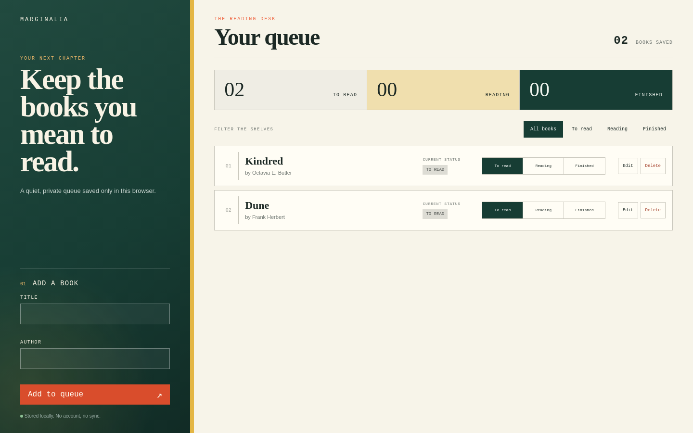

2. Moving Kindred to Reading updates its badge and changes the global counts to 1, 1, and 0.

   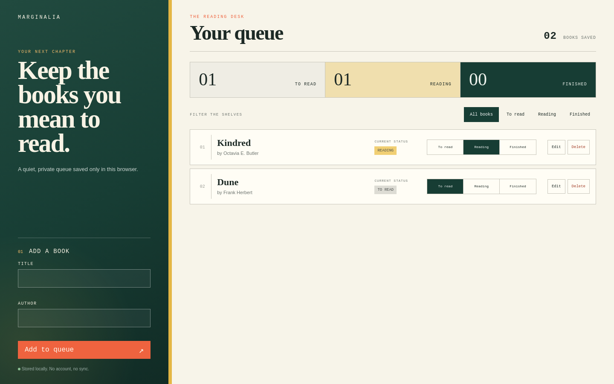

3. Moving Kindred to Finished updates its badge and changes the global counts to 1, 0, and 1.

   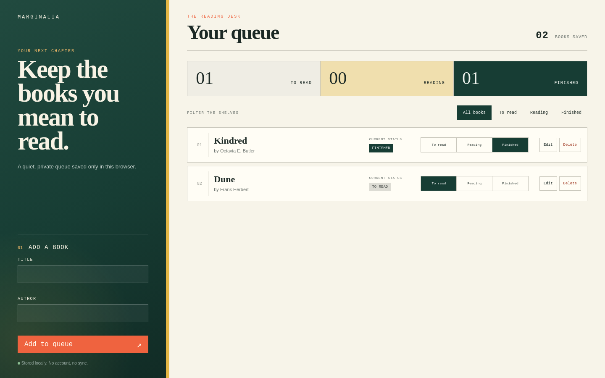

4. Moving Kindred back to To read restores counts of 2, 0, and 0 while preserving book order.

   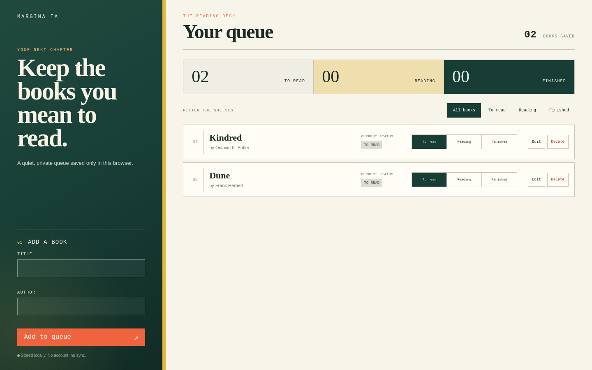

5. A blank title shows the inline Add a title error and leaves the saved Kindred row unchanged.

   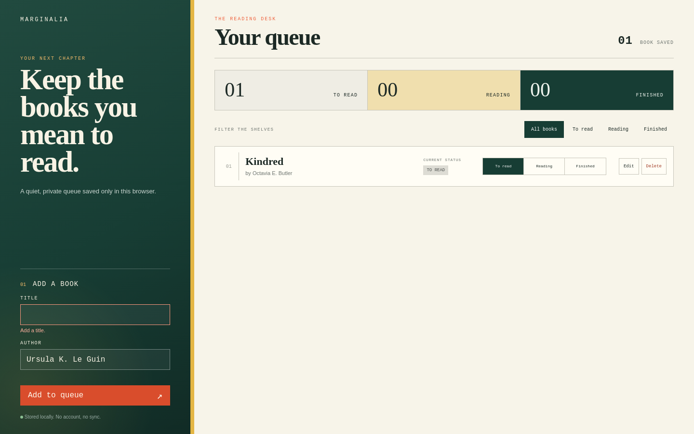

6. The selected Reading filter shows only Kindred while global counts still include The Dispossessed in To read.

   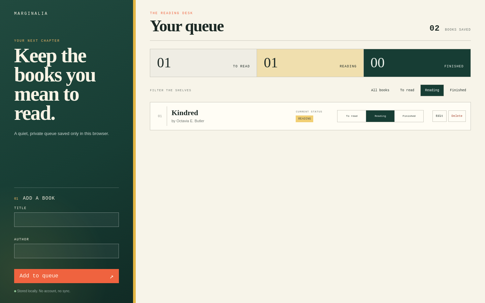

7. The selected Finished filter shows its explicit empty state while the global To read and Reading counts remain visible and unchanged.

   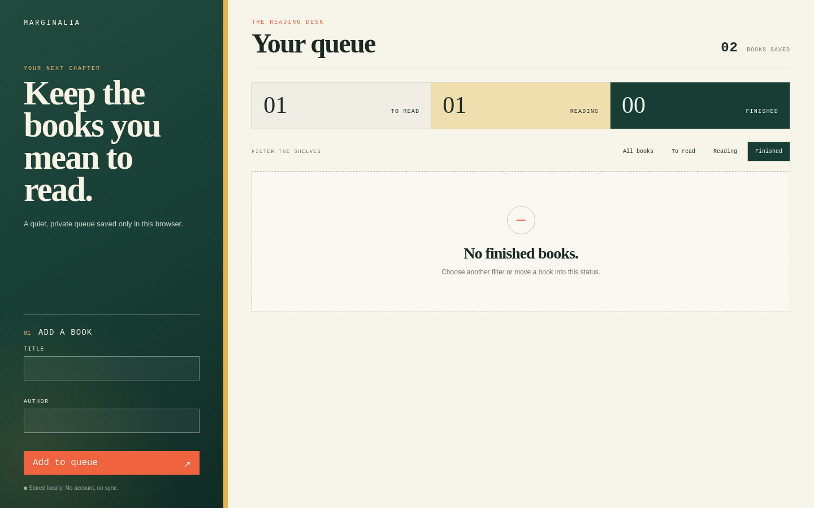

8. A blank author edit shows the inline Add an author error without committing the draft.

   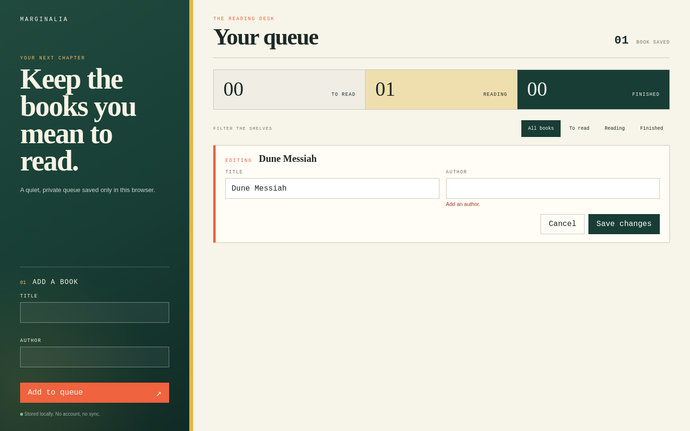

9. After correcting the rejected edit, Dune Messiah still shows Frank Herbert and Reading with the error cleared.

   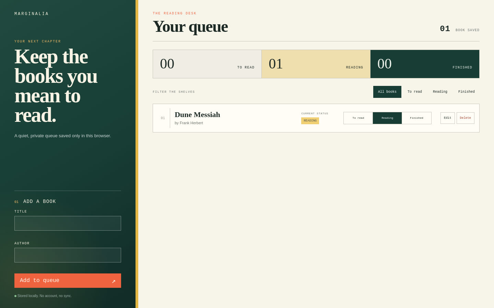

10. Three saved books occupy Finished, Reading, and To read with one global count in each status.

   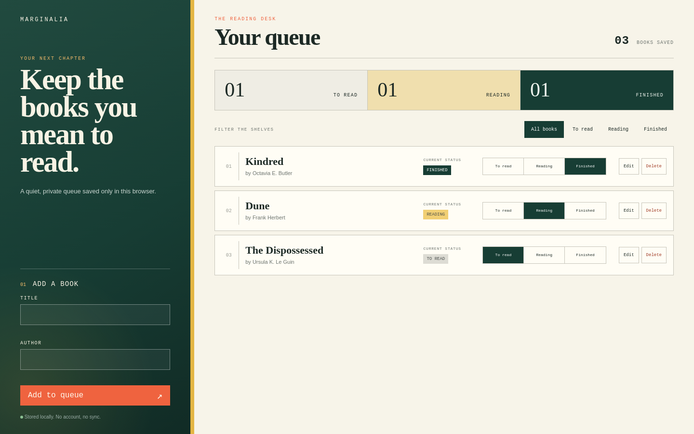

11. Deleting Dune removes its row and reduces only the Reading count to zero.

   

12. After refresh, Kindred and The Dispossessed reload in order with their statuses and counts, and Dune stays deleted.

   

13. After refresh, both literal markup-looking text and the wrapped long title reload from browser storage.

   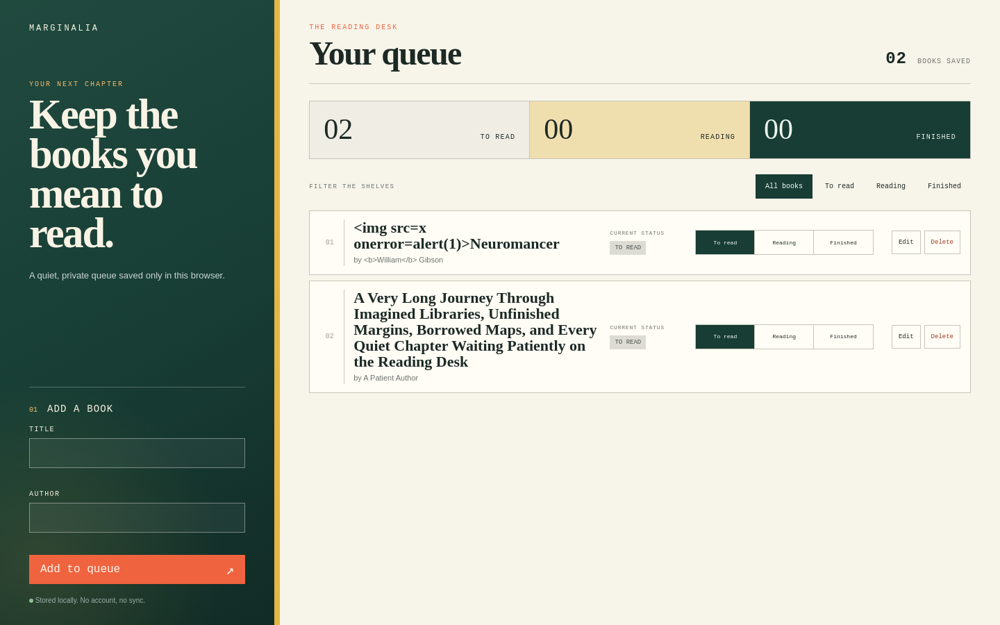

# sac-245 behavior check

*2026-09-17T11:36:27Z by Showboat 0.6.1*
<!-- showboat-id: 0d5629db-4d87-444c-98e5-b5d4071be82b -->

```bash
'runuser' '-u' 'deos-author' '--' 'env' '-i' 'PATH=/usr/local/bin:/usr/bin:/bin' 'HOME=/home/deos-author' 'NODE_EXTRA_CA_CERTS=/etc/cloudflare/certs/cloudflare-containers-ca.crt' 'node' '-e' 'const fs=require('\''fs'\''); const html=fs.readFileSync('\''dist/index.html'\'','\''utf8'\''); const refs=[...html.matchAll(/(?:src|href)="([^"]+)"/g)].map(m=>m[1]).filter(x=>x.startsWith('\''/assets/'\'')); if(refs.length!==2) throw new Error('\''Expected one script and one stylesheet'\''); for(const ref of refs){const path='\''dist'\''+ref; if(!fs.existsSync(path)) throw new Error('\''Missing '\''+path); console.log(ref+'\'' — '\''+fs.statSync(path).size+'\'' bytes'\'')} const bundle=refs.map(ref=>fs.readFileSync('\''dist'\''+ref,'\''utf8'\'')).join('\''\n'\''); if(/https?:\/\//.test(bundle)) throw new Error('\''Unexpected runtime network URL'\''); console.log('\''Static entry point resolves every required asset.'\''); console.log('\''Application bundle contains no runtime network URL.'\'');'

```

```output
/assets/index-BrN4B9mY.js — 12932 bytes
/assets/index-BZYleh6D.css — 7558 bytes
Static entry point resolves every required asset.
Application bundle contains no runtime network URL.
```

