# SAC-243 behavior proof

1. Anonymous first visit to the hosted desktop preview shows the add form, all five filters, an empty ledger, and a €0.00 visible total.

   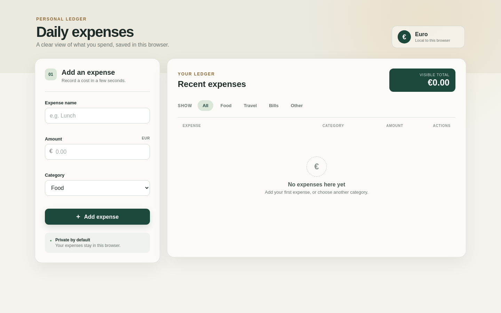

2. Adding Train in Travel leaves both expenses visible and recalculates the exact total to €32.50.

   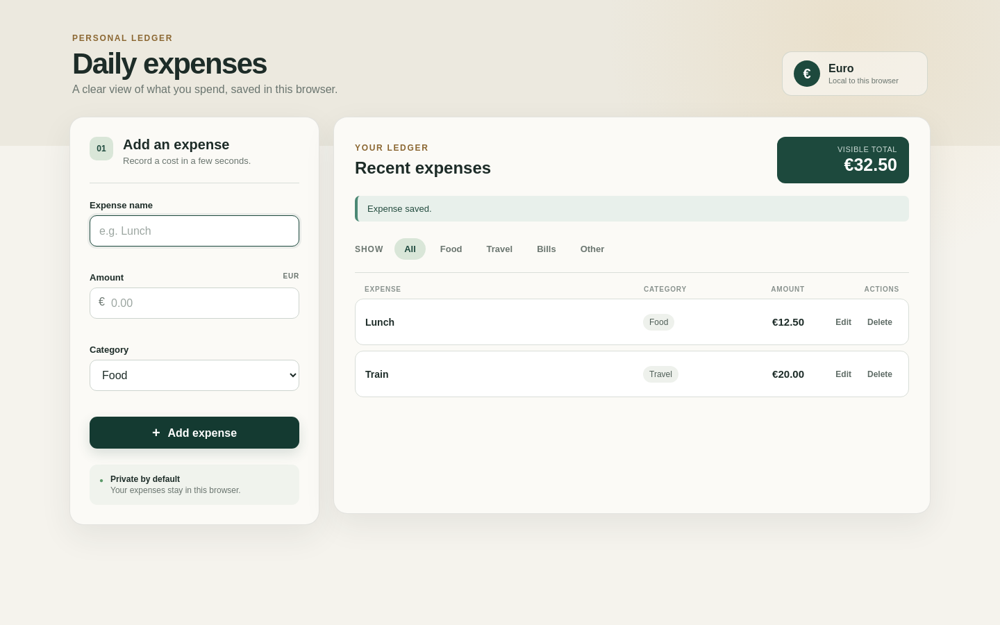

3. Saving the edit replaces Train with Power bill in Bills and recalculates the all-expense total to €58.25.

   

4. After a real refresh, Lunch and Power bill retain the same names, categories, amounts, and €58.25 total.

   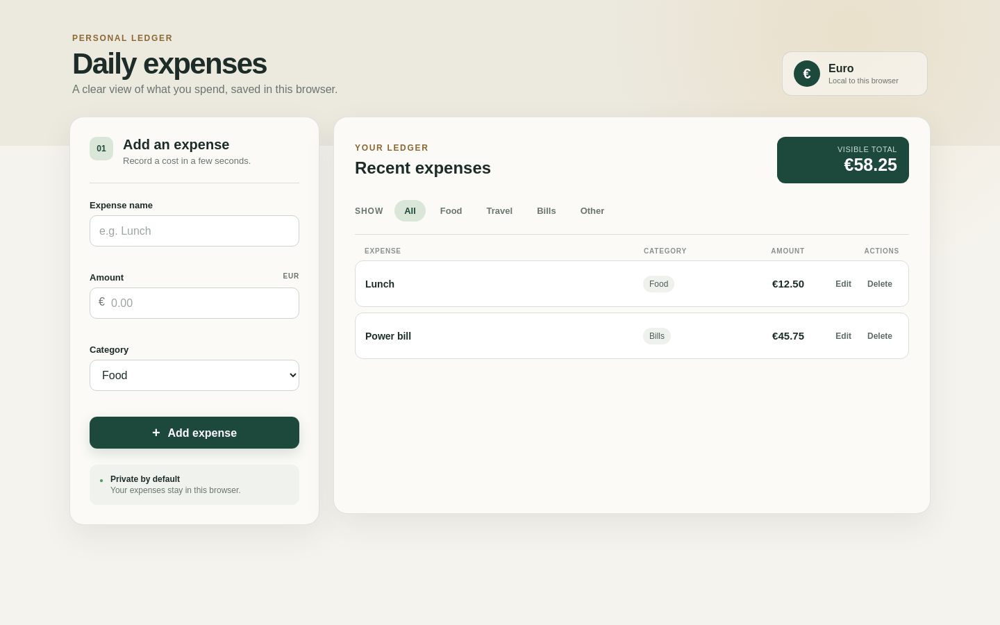

5. After another real refresh, the deleted Lunch expense does not return and Power bill remains saved.

   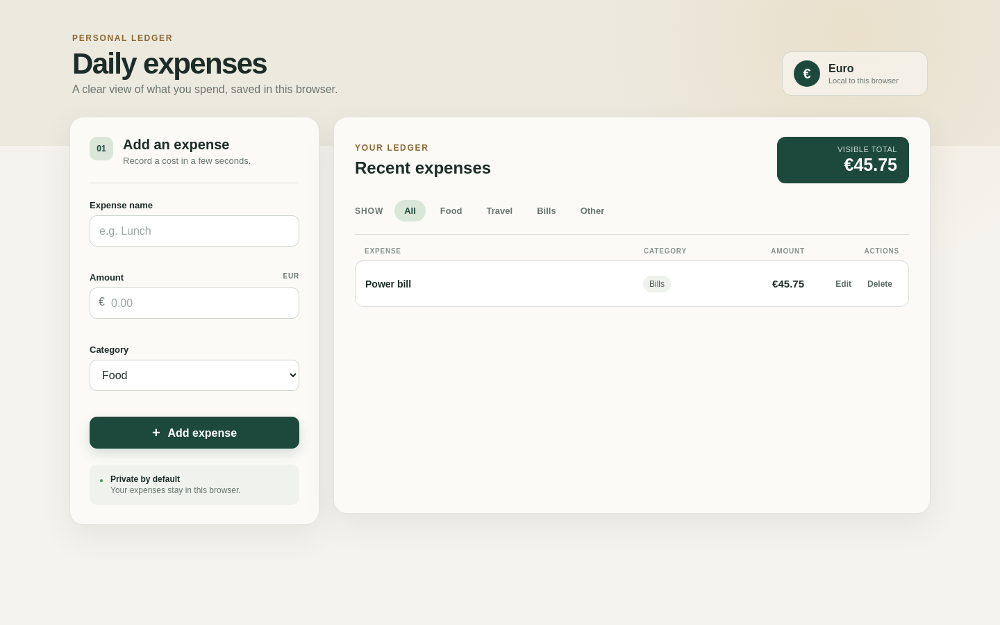

6. A blank name is rejected with a clear name message while the saved Lunch row and €12.50 total stay unchanged.

   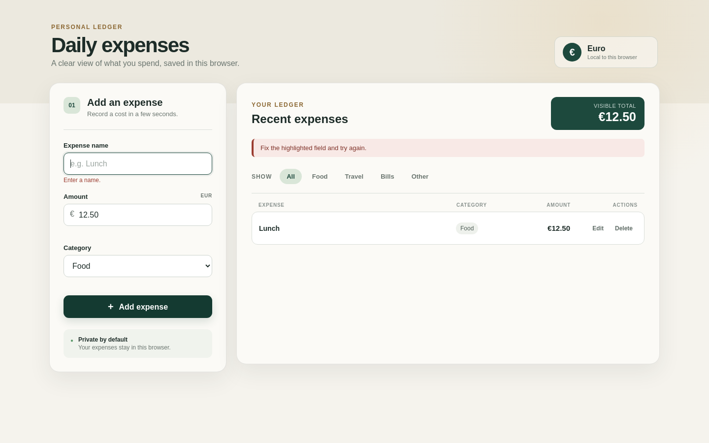

7. An amount with three decimal places is rejected with the two-decimal limit and no Snack row is added.

   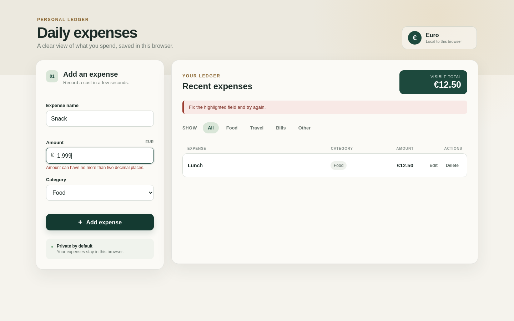

8. A zero-value edit is rejected; the draft stays open while the saved Lunch value remains visibly €12.50.

   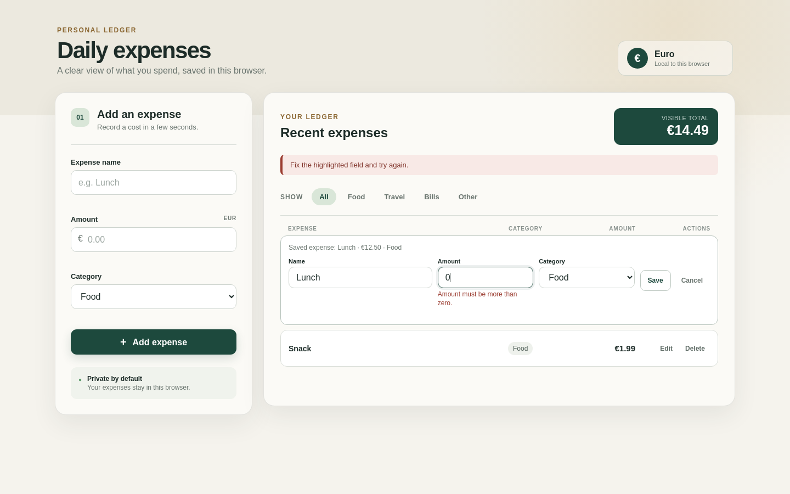

9. The selected Food filter shows only Lunch and changes the visible total to €12.50.

   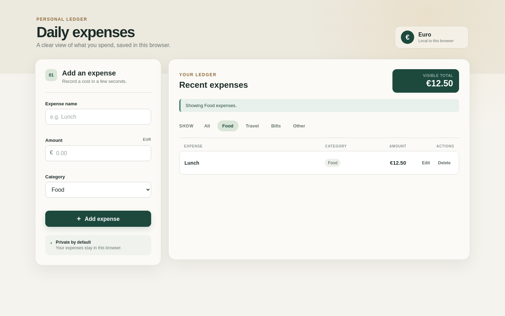

10. The selected Bills filter shows its empty state and a visible total of €0.00 without changing saved expenses.

   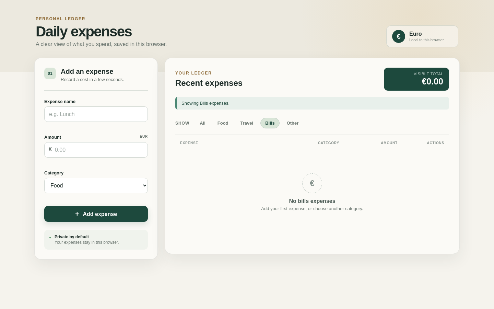

11. Adding a Travel expense while Food is selected switches to All, announces why, shows Taxi, and totals both rows at €20.90.

   

12. Harness-forced allowlist probe — Entertainment is rejected with the four-category message; Concert is absent and Lunch with €12.50 is unchanged.

   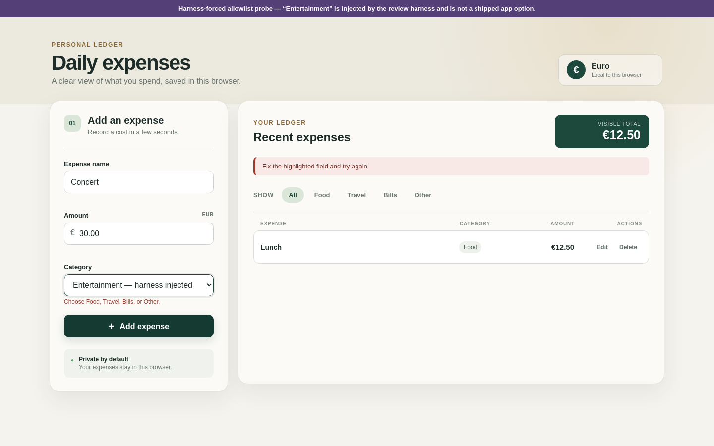

13. The storage harness opens a blocked recovery state: no partial expense is loaded, mutations are disabled, and clearing requires confirmation.

   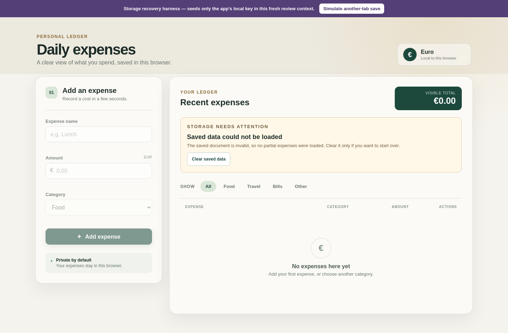

14. A preflight conflict rejects the stale edit, adopts Coffee from the external document, and preserves the €15.00 edit draft for review.

   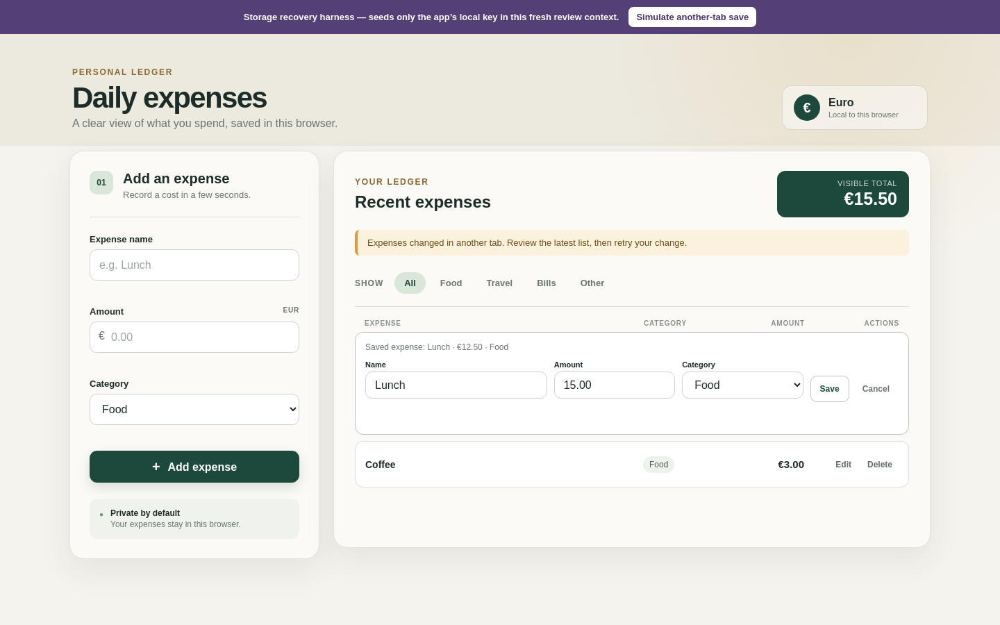

15. After refresh, the recovered and retried document remains saved with Lunch, Coffee, and the €18.00 total.

   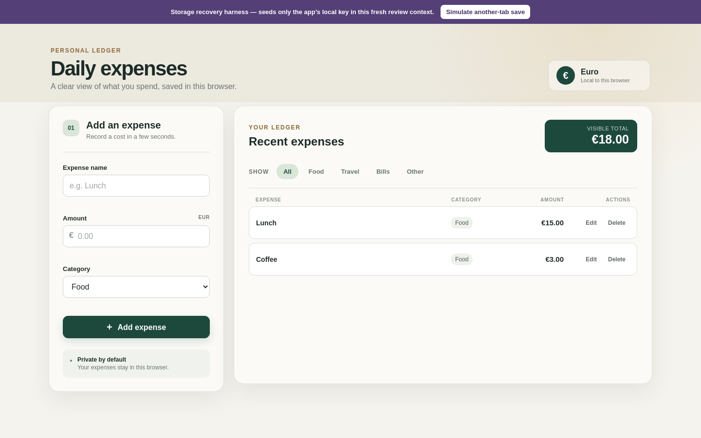

# sac-243 behavior check

*2026-09-17T06:55:45Z by Showboat 0.6.1*
<!-- showboat-id: f2a81010-cd7d-4d69-99b2-dfef82447df9 -->

```bash
'runuser' '-u' 'deos-author' '--' 'env' '-i' 'PATH=/usr/local/bin:/usr/bin:/bin' 'HOME=/home/deos-author' 'NODE_EXTRA_CA_CERTS=/etc/cloudflare/certs/cloudflare-containers-ca.crt' 'node' '/deos/output/requests/behavior-proof.mjs'

```

```output
Unsupported category: rejected with the four-category allowlist; saved document unchanged (1 expense).
Exact large total: €9007199254740994.00
Stale write: rejected; latest valid document adopted with 2 expenses.
```

