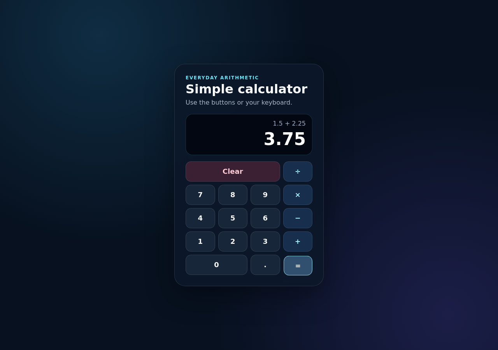

# SAC-225 behavior proof

1. Desktop button input: 1.5 + 2.25 = 3.75

   

2. Desktop button input: 7 − 10 = −3, with the expression above the result

   

3. Desktop keyboard input: 2.5 × 4, then Enter, equals 10

   

4. Desktop error state: 8 ÷ 0 shows Cannot divide by zero

   

5. 320px phone: division-by-zero cleared, then 8 ÷ 2 = 4

   

# sac-225 behavior check

*2026-09-16T11:58:51Z by Showboat 0.6.1*
<!-- showboat-id: 903ecafe-f989-46f8-8280-7b5cbfc9bcdd -->

```bash
'runuser' '-u' 'deos-author' '--' 'env' '-i' 'PATH=/usr/local/bin:/usr/bin:/bin' 'HOME=/home/deos-author' 'node' 'scripts/smoke-preview.mjs' 'https://lecture-democracy-eos-meet.trycloudflare.com'

```

```output
node:internal/deps/undici/undici:15157
      Error.captureStackTrace(err);
            ^

TypeError: fetch failed
    at node:internal/deps/undici/undici:15157:13
    at process.processTicksAndRejections (node:internal/process/task_queues:103:5)
    at async file:///deos/workspace/repository/scripts/smoke-preview.mjs:4:18 {
  [cause]: Error: self-signed certificate in certificate chain
      at TLSSocket.onConnectSecure (node:internal/tls/wrap:1787:34)
      at TLSSocket.emit (node:events:519:28)
      at TLSSocket._finishInit (node:internal/tls/wrap:1176:8)
      at ssl.onhandshakedone (node:internal/tls/wrap:962:12) {
    code: 'SELF_SIGNED_CERT_IN_CHAIN'
  }
}

Node.js v22.23.2
```


# sac-225 behavior check

*2026-09-16T11:59:15Z by Showboat 0.6.1*
<!-- showboat-id: 8ce35be4-ff1e-407b-a2df-d7e868643912 -->

```bash
'runuser' '-u' 'deos-author' '--' 'env' '-i' 'PATH=/usr/local/bin:/usr/bin:/bin' 'HOME=/home/deos-author' '/usr/bin/env' 'NODE_EXTRA_CA_CERTS=/etc/cloudflare/certs/cloudflare-containers-ca.crt' 'node' 'scripts/smoke-preview.mjs' 'https://lecture-democracy-eos-meet.trycloudflare.com'

```

```output
GET https://lecture-democracy-eos-meet.trycloudflare.com
HTTP 520
Origin is disallowed
file:///deos/workspace/repository/scripts/smoke-preview.mjs:10
if (!response.ok) throw new Error(`Preview returned HTTP ${response.status}`);
                        ^

Error: Preview returned HTTP 520
    at file:///deos/workspace/repository/scripts/smoke-preview.mjs:10:25
    at process.processTicksAndRejections (node:internal/process/task_queues:103:5)

Node.js v22.23.2
```


# sac-225 behavior check

*2026-09-16T12:01:09Z by Showboat 0.6.1*
<!-- showboat-id: 6b77e9de-9fe8-41d8-bea0-e009c294feb4 -->

```bash
'runuser' '-u' 'deos-author' '--' 'env' '-i' 'PATH=/usr/local/bin:/usr/bin:/bin' 'HOME=/home/deos-author' 'node' 'scripts/demo-local-workerd.mjs'

```

```output
Built dist contents:
- dist/assets/index-BrA0vk07.css
- dist/assets/index-gEckXhNy.js
- dist/index.html
[workerd] 
 ⛅️ wrangler 4.132.0
────────────────────
[workerd] No Functions. Shimming...
[workerd] Your Worker has access to the following bindings:
Binding                                                                   Resource                  Mode
env.CF_PAGES ("1")                                                        Environment Variable      local
[workerd] env.CF_PAGES_BRANCH ("deos/01a0aa08-3cdf-7bfd-96fa-c522814b...")          Environment Variable      local
[workerd] env.CF_PAGES_COMMIT_SHA ("a1dcf3d18e0d20e483e507079a1e1fbe8b490...")      Environment Variable      local
env.CF_PAGES_URL ("https://a1dcf3d.repository.pages.dev")                 Environment Variable      local
[workerd] 
[workerd] [wrangler:warn] Unable to fetch the `Request.cf` object! Falling back to a default placeholder...
SyntaxError: Unexpected token 'O', "Origin is disallowed" is not valid JSON
    at JSON.parse (<anonymous>)
    at setupCf (/deos/workspace/repository/node_modules/miniflare/dist/src/index.js:53613:27)
    at process.processTicksAndRejections (node:internal/process/task_queues:103:5)
    at async #assembleConfig (/deos/workspace/repository/node_modules/miniflare/dist/src/index.js:117680:21)
    at async #assembleAndUpdateConfig (/deos/workspace/repository/node_modules/miniflare/dist/src/index.js:118049:21)
    at async /deos/workspace/repository/node_modules/miniflare/dist/src/index.js:116884:7
    at async Mutex.runWith (/deos/workspace/repository/node_modules/miniflare/dist/src/index.js:55585:16)
[workerd] ⎔ Starting local server...
[workerd] [wrangler:warn] Unable to fetch the `Request.cf` object! Falling back to a default placeholder...
SyntaxError: Unexpected token 'O', "Origin is disallowed" is not valid JSON
    at JSON.parse (<anonymous>)
    at setupCf (/deos/workspace/repository/node_modules/miniflare/dist/src/index.js:53613:27)
    at process.processTicksAndRejections (node:internal/process/task_queues:103:5)
    at async #assembleConfig (/deos/workspace/repository/node_modules/miniflare/dist/src/index.js:117680:21)
    at async #assembleAndUpdateConfig (/deos/workspace/repository/node_modules/miniflare/dist/src/index.js:118049:21)
    at async /deos/workspace/repository/node_modules/miniflare/dist/src/index.js:116884:7
    at async Mutex.runWith (/deos/workspace/repository/node_modules/miniflare/dist/src/index.js:55585:16)
    at async #waitForReady (/deos/workspace/repository/node_modules/miniflare/dist/src/index.js:118234:5)
    at async #onBundleComplete (/deos/workspace/repository/node_modules/wrangler/wrangler-dist/cli.js:357663:33)
    at async Mutex.runWith (/deos/workspace/repository/node_modules/miniflare/dist/src/index.js:55585:16)
Intentional empty-assets smoke test failed safely: workerd did not become ready within 30000ms: fetch failed
Decision: this failed preview is not presented for review.
[workerd] 
 ⛅️ wrangler 4.132.0
────────────────────
[workerd] No Functions. Shimming...
[workerd] Your Worker has access to the following bindings:
[workerd] Binding                                                                   Resource                  Mode
env.CF_PAGES ("1")                                                        Environment Variable      local
env.CF_PAGES_BRANCH ("deos/01a0aa08-3cdf-7bfd-96fa-c522814b...")          Environment Variable      local
env.CF_PAGES_COMMIT_SHA ("a1dcf3d18e0d20e483e507079a1e1fbe8b490...")      Environment Variable      local
[workerd] env.CF_PAGES_URL ("https://a1dcf3d.repository.pages.dev")                 Environment Variable      local
[workerd] 
[workerd] [wrangler:warn] Unable to fetch the `Request.cf` object! Falling back to a default placeholder...
SyntaxError: Unexpected token 'O', "Origin is disallowed" is not valid JSON
    at JSON.parse (<anonymous>)
    at setupCf (/deos/workspace/repository/node_modules/miniflare/dist/src/index.js:53613:27)
    at process.processTicksAndRejections (node:internal/process/task_queues:103:5)
    at async #assembleConfig (/deos/workspace/repository/node_modules/miniflare/dist/src/index.js:117680:21)
    at async #assembleAndUpdateConfig (/deos/workspace/repository/node_modules/miniflare/dist/src/index.js:118049:21)
    at async /deos/workspace/repository/node_modules/miniflare/dist/src/index.js:116884:7
    at async Mutex.runWith (/deos/workspace/repository/node_modules/miniflare/dist/src/index.js:55585:16)
[workerd] ⎔ Starting local server...
[workerd] [wrangler:warn] Unable to fetch the `Request.cf` object! Falling back to a default placeholder...
SyntaxError: Unexpected token 'O', "Origin is disallowed" is not valid JSON
    at JSON.parse (<anonymous>)
    at setupCf (/deos/workspace/repository/node_modules/miniflare/dist/src/index.js:53613:27)
    at process.processTicksAndRejections (node:internal/process/task_queues:103:5)
    at async #assembleConfig (/deos/workspace/repository/node_modules/miniflare/dist/src/index.js:117680:21)
    at async #assembleAndUpdateConfig (/deos/workspace/repository/node_modules/miniflare/dist/src/index.js:118049:21)
    at async /deos/workspace/repository/node_modules/miniflare/dist/src/index.js:116884:7
    at async Mutex.runWith (/deos/workspace/repository/node_modules/miniflare/dist/src/index.js:55585:16)
    at async #waitForReady (/deos/workspace/repository/node_modules/miniflare/dist/src/index.js:118234:5)
    at async #onBundleComplete (/deos/workspace/repository/node_modules/wrangler/wrangler-dist/cli.js:357663:33)
    at async Mutex.runWith (/deos/workspace/repository/node_modules/miniflare/dist/src/index.js:55585:16)
file:///deos/workspace/repository/scripts/demo-local-workerd.mjs:62
  throw new Error('workerd did not become ready within ' + timeoutMs + 'ms: ' + (lastError?.message ?? 'unknown error'));
        ^

Error: workerd did not become ready within 30000ms: The operation was aborted due to timeout
    at requestUntilReady (file:///deos/workspace/repository/scripts/demo-local-workerd.mjs:62:9)
    at async file:///deos/workspace/repository/scripts/demo-local-workerd.mjs:83:20

Node.js v22.23.2
```


# sac-225 behavior check

*2026-09-16T12:21:16Z by Showboat 0.6.1*
<!-- showboat-id: 32680ff4-fdb5-4585-b9de-f1d4ad22993c -->

```bash
'runuser' '-u' 'deos-author' '--' 'env' '-i' 'PATH=/usr/local/bin:/usr/bin:/bin' 'HOME=/home/deos-author' '/usr/bin/env' 'NODE_EXTRA_CA_CERTS=/etc/cloudflare/certs/cloudflare-containers-ca.crt' 'node' 'scripts/smoke-preview.mjs' 'https://reform-accuracy-suggested-cancer.trycloudflare.com'

```

```output
GET https://reform-accuracy-suggested-cancer.trycloudflare.com
HTTP 520
Origin is disallowed
file:///deos/workspace/repository/scripts/smoke-preview.mjs:10
if (!response.ok) throw new Error(`Preview returned HTTP ${response.status}`);
                        ^

Error: Preview returned HTTP 520
    at file:///deos/workspace/repository/scripts/smoke-preview.mjs:10:25
    at process.processTicksAndRejections (node:internal/process/task_queues:103:5)

Node.js v22.23.2
```


# sac-225 behavior check

*2026-09-16T12:21:37Z by Showboat 0.6.1*
<!-- showboat-id: ffb88934-d652-4036-871b-bc0a1d8a73a0 -->

```bash
'runuser' '-u' 'deos-author' '--' 'env' '-i' 'PATH=/usr/local/bin:/usr/bin:/bin' 'HOME=/home/deos-author' 'node' 'scripts/smoke-preview.mjs' 'http://127.0.0.1:8787'

```

```output
GET http://127.0.0.1:8787
HTTP 200
<!doctype html> <html lang="en"> <head> <meta charset="UTF-8" /> <meta name="viewport" content="width=device-width, initial-scale=1.0" /> <meta name="description" content="A simple calculator for four basic operations." /> <title>Simple calculator</title> <script type="module" crossorigin src="/assets/index-gEckXhNy.js"></script> <link rel="stylesheet" crossorigin href="/assets/index-BrA0vk07.css"> </head> <body> <main class="page-shell"> <section class="c
Smoke test passed: calculator shell and output are present.
```

