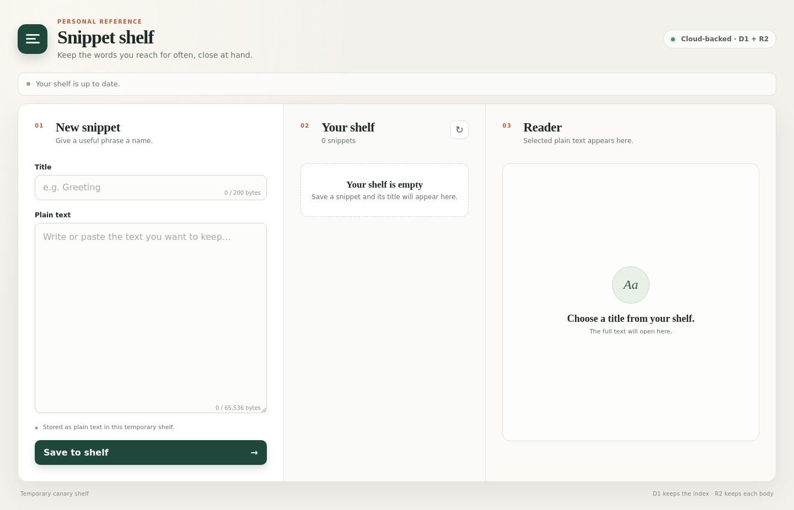
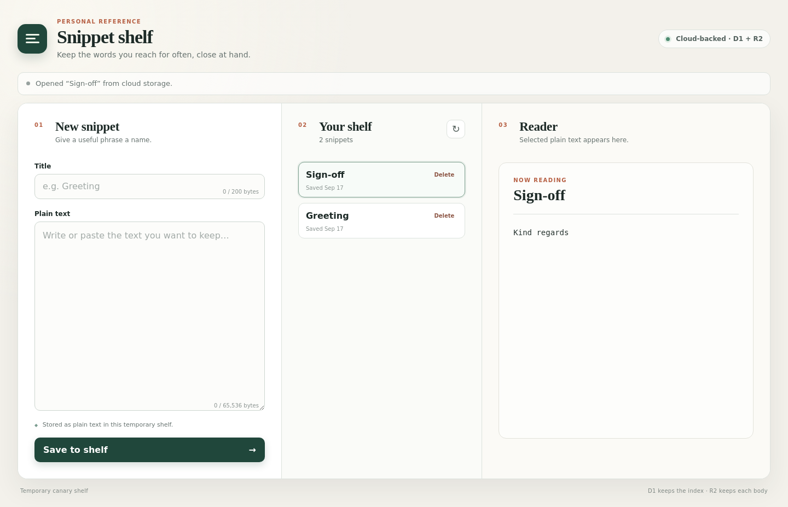
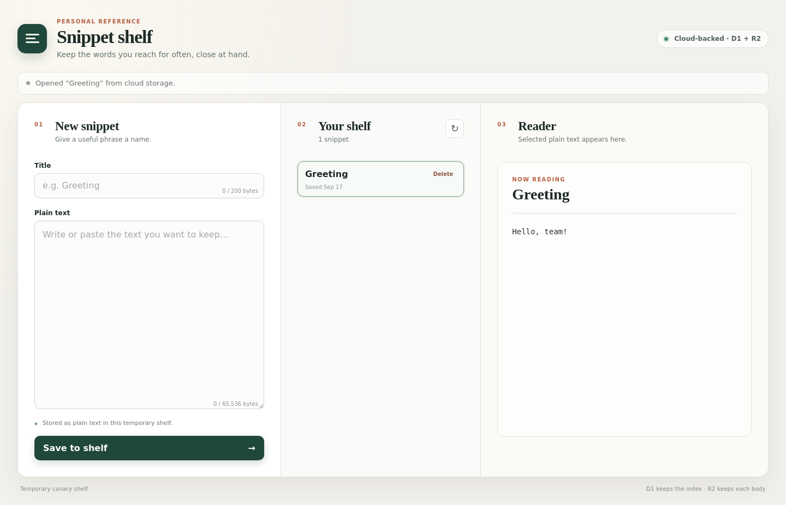
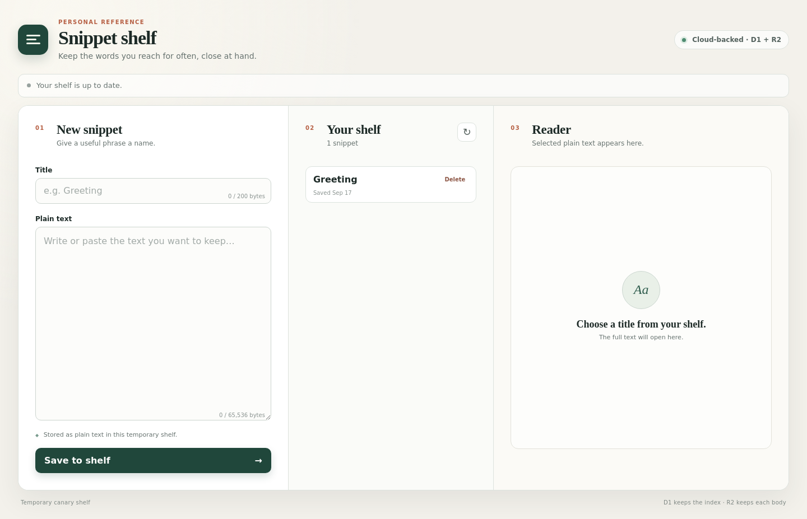
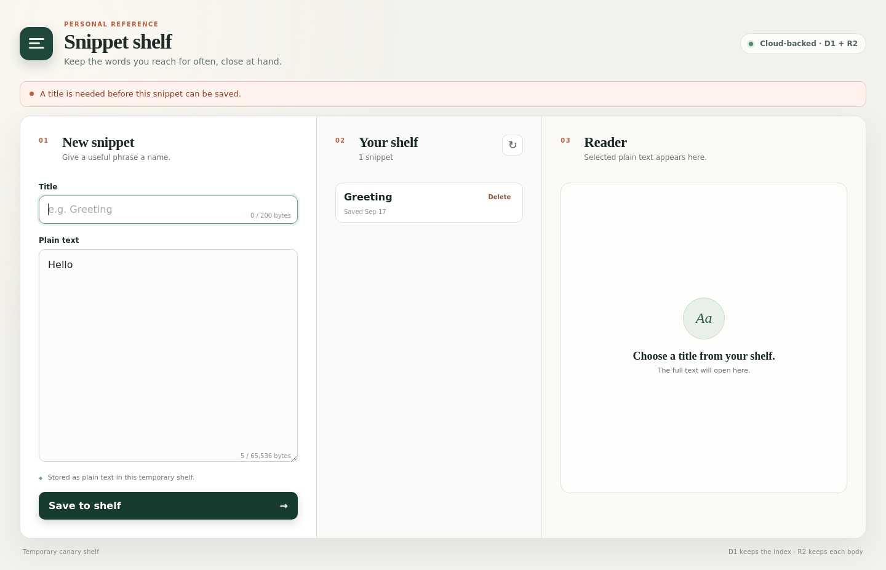
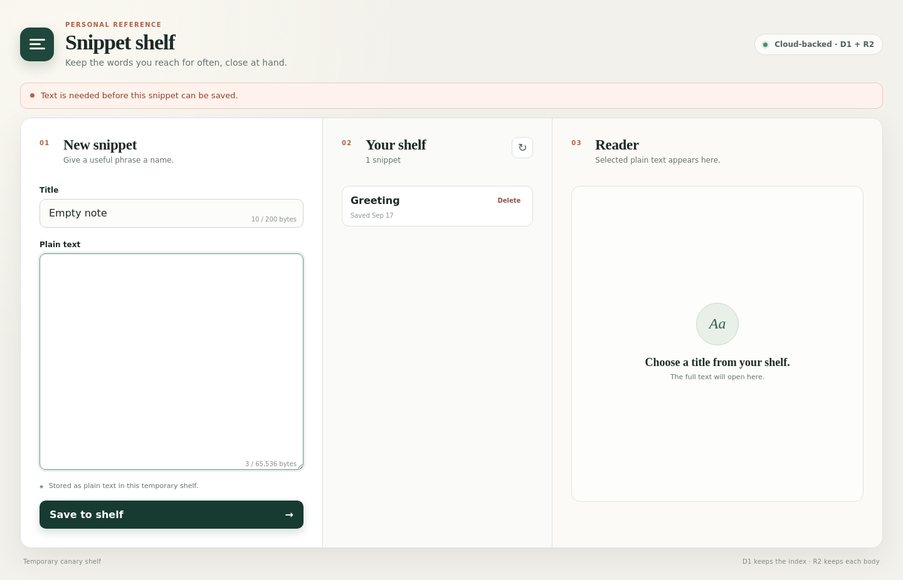
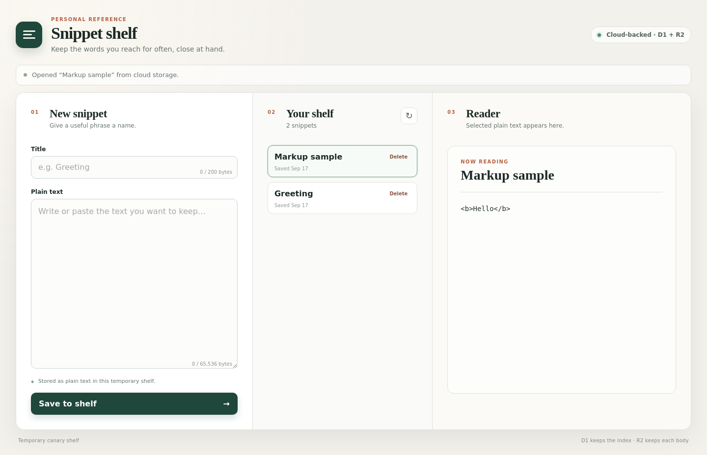
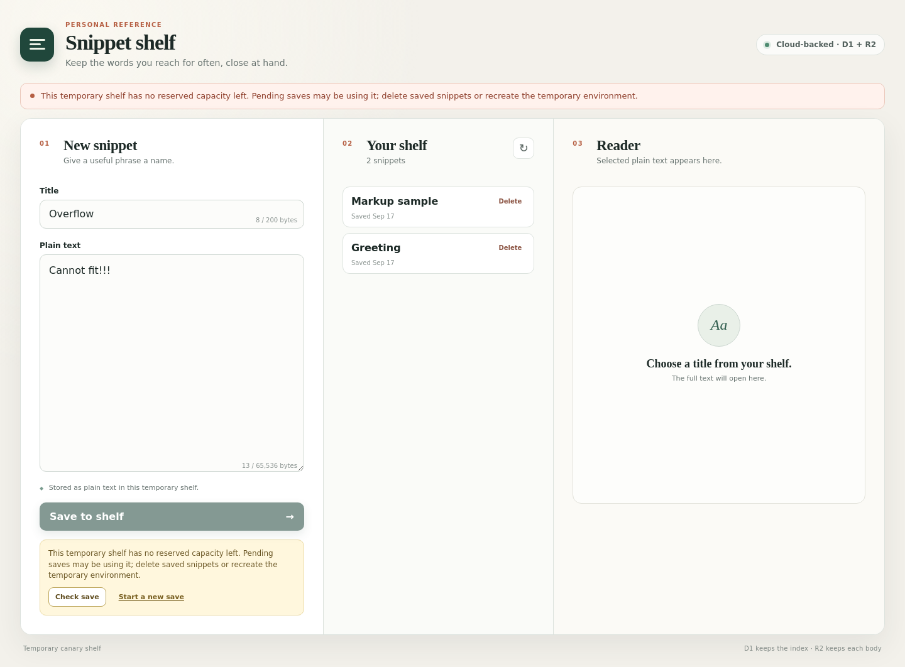

# SAC-246 behavior proof

1. The newly migrated remote shelf opens empty on one desktop screen, with no login and the D1 + R2 cloud badge visible.

   

2. Two cloud-backed snippets are listed, and selecting Sign-off shows its own Kind regards body.

   

3. After deleting Sign-off, Greeting remains listed and readable with Hello, team!.

   

4. A fresh browser context rebuilds the unchanged cloud shelf with Greeting listed, Sign-off absent, and no reader selection carried over.

   

5. Selecting Greeting in the fresh context reads Hello, team! from the remote shelf.

   

6. Submitting text without a title shows the title-required error and leaves Greeting as the only saved snippet.

   

7. Submitting Empty note with spaces-only text shows the text-required error and leaves the cloud shelf unchanged.

   

8. Markup-looking content is displayed literally as \<b\>Hello\</b\> in the plain-text reader.

   

9. A real remote save beyond the approved capacity is rejected with a clear no-capacity message, the form preserved, and no success state.

   

# sac-246 behavior check

*2026-09-17T18:36:05Z by Showboat 0.6.1*
<!-- showboat-id: 4c928c43-a56a-4202-8daa-e1950cb79ff9 -->

```bash
'runuser' '-u' 'deos-author' '--' 'env' '-i' 'PATH=/usr/local/bin:/usr/bin:/bin' 'HOME=/home/deos-author' 'NODE_EXTRA_CA_CERTS=/etc/cloudflare/certs/cloudflare-containers-ca.crt' 'node' 'scripts/verify-remote-storage.mjs' '/deos/output/requests/baseline-d1-v2.json' '/deos/output/requests/baseline-r2-v2.json' '/deos/output/requests/baseline-api-v2.json' '/deos/output/requests/capacity-state-v2.json' '/deos/output/requests/capacity-overflow-absent-v2.json' '/deos/output/requests/capacity-fixture-cleanup-v2.json' '/deos/output/requests/final-d1-snippets-v2.json' '/deos/output/requests/final-d1-operations-v2.json' '/deos/output/requests/final-r2-list-v2.json' '/deos/output/requests/final-api-list-v2.json' '/deos/output/requests/final-r2-markup-v2.json' '/deos/output/requests/final-r2-greeting-v2.json'

```

```output
## baseline-d1-v2.json
{
  "request": {
    "operation": "query",
    "sql": "SELECT id, title, object_key, created_at FROM snippets ORDER BY created_at DESC, id DESC"
  },
  "environment": "deos-tmp-873042d0a43055bc7dd07526",
  "result": {
    "success": true,
    "meta": {
      "served_by": "v3-prod",
      "served_by_region": "EEUR",
      "served_by_colo": "ARN",
      "served_by_primary": true,
      "timings": {
        "sql_duration_ms": 0.4034
      },
      "duration": 0.4034,
      "changes": 0,
      "last_row_id": 1,
      "changed_db": false,
      "size_after": 53248,
      "rows_read": 1,
      "rows_written": 0,
      "total_attempts": 1
    },
    "results": []
  }
}
## baseline-r2-v2.json
{
  "request": {
    "operation": "objects"
  },
  "environment": "deos-tmp-873042d0a43055bc7dd07526",
  "result": {
    "objects": [],
    "truncated": false,
    "cursor": null
  }
}
## baseline-api-v2.json
{
  "request": {
    "operation": "request",
    "method": "GET",
    "path": "/api/snippets"
  },
  "environment": "deos-tmp-873042d0a43055bc7dd07526",
  "result": {
    "status": 200,
    "body": "{\"snippets\":[]}"
  }
}
## capacity-state-v2.json
{
  "request": {
    "operation": "query",
    "sql": "SELECT state, COUNT(*) AS operation_count, SUM(reserved_bytes) AS reserved_bytes FROM snippet_operations GROUP BY state ORDER BY state"
  },
  "environment": "deos-tmp-873042d0a43055bc7dd07526",
  "result": {
    "success": true,
    "meta": {
      "served_by": "v3-prod",
      "served_by_region": "EEUR",
      "served_by_colo": "ARN",
      "served_by_primary": true,
      "timings": {
        "sql_duration_ms": 0.1954
      },
      "duration": 0.1954,
      "changes": 0,
      "last_row_id": 0,
      "changed_db": false,
      "size_after": 61440,
      "rows_read": 38,
      "rows_written": 0,
      "total_attempts": 1
    },
    "results": [
      {
        "state": "active",
        "operation_count": 2,
        "reserved_bytes": 24
      },
      {
        "state": "creating",
        "operation_count": 16,
        "reserved_bytes": 1048540
      },
      {
        "state": "deleted",
        "operation_count": 1,
        "reserved_bytes": 0
      }
    ]
  }
}
## capacity-overflow-absent-v2.json
{
  "request": {
    "operation": "query",
    "sql": "SELECT COUNT(*) AS overflow_rows FROM snippets WHERE title = 'Overflow'"
  },
  "environment": "deos-tmp-873042d0a43055bc7dd07526",
  "result": {
    "success": true,
    "meta": {
      "served_by": "v3-prod",
      "served_by_region": "EEUR",
      "served_by_colo": "ARN",
      "served_by_primary": true,
      "timings": {
        "sql_duration_ms": 0.2337
      },
      "duration": 0.2337,
      "changes": 0,
      "last_row_id": 0,
      "changed_db": false,
      "size_after": 61440,
      "rows_read": 2,
      "rows_written": 0,
      "total_attempts": 1
    },
    "results": [
      {
        "overflow_rows": 0
      }
    ]
  }
}
## capacity-fixture-cleanup-v2.json
{
  "request": {
    "operation": "migrate",
    "id": "synthetic-capacity-cleanup-v2"
  },
  "environment": "deos-tmp-873042d0a43055bc7dd07526",
  "result": {
    "id": "synthetic-capacity-cleanup-v2",
    "digest": "70ef6f41dfeb49d46163afd305a354bc8b3a01a630443baf16d4e62ca90d97ee",
    "reused": false
  }
}
## final-d1-snippets-v2.json
{
  "request": {
    "operation": "query",
    "sql": "SELECT id, title, object_key, body_sha256, body_bytes, created_at FROM snippets ORDER BY created_at DESC, id DESC"
  },
  "environment": "deos-tmp-873042d0a43055bc7dd07526",
  "result": {
    "success": true,
    "meta": {
      "served_by": "v3-prod",
      "served_by_region": "EEUR",
      "served_by_colo": "ARN",
      "served_by_primary": true,
      "timings": {
        "sql_duration_ms": 0.1751
      },
      "duration": 0.1751,
      "changes": 0,
      "last_row_id": 0,
      "changed_db": false,
      "size_after": 53248,
      "rows_read": 2,
      "rows_written": 0,
      "total_attempts": 1
    },
    "results": [
      {
        "id": "a8ed3f19-9b20-438d-9911-f1584e065129",
        "title": "Markup sample",
        "object_key": "snippets/a8ed3f19-9b20-438d-9911-f1584e065129/12008c684781ad0d1a19a285220d8d098626ac770cc0d42ea7220c8361263564.txt",
        "body_sha256": "12008c684781ad0d1a19a285220d8d098626ac770cc0d42ea7220c8361263564",
        "body_bytes": 12,
        "created_at": "2026-09-17T18:31:29.078Z"
      },
      {
        "id": "e9190a29-4cf1-41d5-97b8-48744e79f017",
        "title": "Greeting",
        "object_key": "snippets/e9190a29-4cf1-41d5-97b8-48744e79f017/4ede3b747d1cdd666e839357d1d6fd60910bb2a3a0eb9b8130f22e61cc02f61b.txt",
        "body_sha256": "4ede3b747d1cdd666e839357d1d6fd60910bb2a3a0eb9b8130f22e61cc02f61b",
        "body_bytes": 12,
        "created_at": "2026-09-17T18:28:52.031Z"
      }
    ]
  }
}
## final-d1-operations-v2.json
{
  "request": {
    "operation": "query",
    "sql": "SELECT id, object_key, reserved_bytes, state, delete_title, created_at, updated_at FROM snippet_operations ORDER BY created_at DESC, id DESC"
  },
  "environment": "deos-tmp-873042d0a43055bc7dd07526",
  "result": {
    "success": true,
    "meta": {
      "served_by": "v3-prod",
      "served_by_region": "EEUR",
      "served_by_colo": "ARN",
      "served_by_primary": true,
      "timings": {
        "sql_duration_ms": 0.2716
      },
      "duration": 0.2716,
      "changes": 0,
      "last_row_id": 0,
      "changed_db": false,
      "size_after": 53248,
      "rows_read": 6,
      "rows_written": 0,
      "total_attempts": 1
    },
    "results": [
      {
        "id": "a8ed3f19-9b20-438d-9911-f1584e065129",
        "object_key": "snippets/a8ed3f19-9b20-438d-9911-f1584e065129/12008c684781ad0d1a19a285220d8d098626ac770cc0d42ea7220c8361263564.txt",
        "reserved_bytes": 12,
        "state": "active",
        "delete_title": null,
        "created_at": "2026-09-17T18:31:29.078Z",
        "updated_at": "2026-09-17T18:31:29.368Z"
      },
      {
        "id": "57873b39-6c6d-4d5a-b2da-fea72d8b47b3",
        "object_key": "snippets/57873b39-6c6d-4d5a-b2da-fea72d8b47b3/c88baa810a3509134520fb4c646b3acd4f1296d5ab007205c320ff0c14d056f3.txt",
        "reserved_bytes": 0,
        "state": "deleted",
        "delete_title": null,
        "created_at": "2026-09-17T18:29:09.272Z",
        "updated_at": "2026-09-17T18:29:44.893Z"
      },
      {
        "id": "e9190a29-4cf1-41d5-97b8-48744e79f017",
        "object_key": "snippets/e9190a29-4cf1-41d5-97b8-48744e79f017/4ede3b747d1cdd666e839357d1d6fd60910bb2a3a0eb9b8130f22e61cc02f61b.txt",
        "reserved_bytes": 12,
        "state": "active",
        "delete_title": null,
        "created_at": "2026-09-17T18:28:52.031Z",
        "updated_at": "2026-09-17T18:28:52.790Z"
      }
    ]
  }
}
## final-r2-list-v2.json
{
  "request": {
    "operation": "objects"
  },
  "environment": "deos-tmp-873042d0a43055bc7dd07526",
  "result": {
    "objects": [
      {
        "key": "snippets/a8ed3f19-9b20-438d-9911-f1584e065129/12008c684781ad0d1a19a285220d8d098626ac770cc0d42ea7220c8361263564.txt",
        "size": 12,
        "etag": "ac574127c09a7d6c4ef58434f70f7f4a"
      },
      {
        "key": "snippets/e9190a29-4cf1-41d5-97b8-48744e79f017/4ede3b747d1cdd666e839357d1d6fd60910bb2a3a0eb9b8130f22e61cc02f61b.txt",
        "size": 12,
        "etag": "129252b2c73e6e9d93cbcbf103a23516"
      }
    ],
    "truncated": false,
    "cursor": null
  }
}
## final-api-list-v2.json
{
  "request": {
    "operation": "request",
    "method": "GET",
    "path": "/api/snippets"
  },
  "environment": "deos-tmp-873042d0a43055bc7dd07526",
  "result": {
    "status": 200,
    "body": "{\"snippets\":[{\"id\":\"a8ed3f19-9b20-438d-9911-f1584e065129\",\"title\":\"Markup sample\",\"createdAt\":\"2026-09-17T18:31:29.078Z\",\"deletePending\":false},{\"id\":\"e9190a29-4cf1-41d5-97b8-48744e79f017\",\"title\":\"Greeting\",\"createdAt\":\"2026-09-17T18:28:52.031Z\",\"deletePending\":false}]}"
  }
}
## final-r2-markup-v2.json
{
  "request": {
    "operation": "object",
    "key": "snippets/a8ed3f19-9b20-438d-9911-f1584e065129/12008c684781ad0d1a19a285220d8d098626ac770cc0d42ea7220c8361263564.txt"
  },
  "environment": "deos-tmp-873042d0a43055bc7dd07526",
  "result": {
    "key": "snippets/a8ed3f19-9b20-438d-9911-f1584e065129/12008c684781ad0d1a19a285220d8d098626ac770cc0d42ea7220c8361263564.txt",
    "size": 12,
    "sha256": "12008c684781ad0d1a19a285220d8d098626ac770cc0d42ea7220c8361263564",
    "contentBase64": "PGI+SGVsbG88L2I+",
    "contentUtf8": "<b>Hello</b>"
  }
}
## final-r2-greeting-v2.json
{
  "request": {
    "operation": "object",
    "key": "snippets/e9190a29-4cf1-41d5-97b8-48744e79f017/4ede3b747d1cdd666e839357d1d6fd60910bb2a3a0eb9b8130f22e61cc02f61b.txt"
  },
  "environment": "deos-tmp-873042d0a43055bc7dd07526",
  "result": {
    "key": "snippets/e9190a29-4cf1-41d5-97b8-48744e79f017/4ede3b747d1cdd666e839357d1d6fd60910bb2a3a0eb9b8130f22e61cc02f61b.txt",
    "size": 12,
    "sha256": "4ede3b747d1cdd666e839357d1d6fd60910bb2a3a0eb9b8130f22e61cc02f61b",
    "contentBase64": "SGVsbG8sIHRlYW0h",
    "contentUtf8": "Hello, team!"
  }
}
```

